# quorum-rs

### One LLM guesses. A quorum argues until it's sure.

[](https://crates.io/crates/quorum-rs)
[](https://docs.rs/quorum-rs)
[](#license)

Throw many models at one question. They answer in parallel, grade each other's
work, and the protocol stops the instant they agree — so you get a checked
answer, not a single model's first guess, without burning a fixed iteration
budget.

```mermaid
flowchart TD
    Q(["Is this auth middleware safe?"]) -->|fan out| A[gpt-4o]
    Q --> B[claude]
    Q --> C[qwen-72b]
    A -->|propose| X{{grade each other}}
    B --> X
    C --> X
    X -->|converge early once they agree| V(["&#10007; Unsafe — expiry check uses &lt; not &lt;=,<br/>off-by-one lets a just-expired token through.<br/>2 of 3 agents flagged it."])
```



Three mediocre models that *disagree well* beat one big model that's confidently
wrong. Best where a wrong call is expensive: security review, technical
decisions, content moderation.

Paper: [arXiv:2601.16863](https://arxiv.org/abs/2601.16863).
`quorum-rs` is the open-source SDK + runtime + `quorum` CLI for building agents
against this protocol. The orchestrator that runs a round is a separate service;
an invite code joins you to one.

## Run it

Invite code → live agent, five commands:

```bash
cargo install quorum-rs
quorum redeem eyJhbGc...        # invite → local NATS creds + operator token
quorum init                    # scaffold quorum.yml (providers + agents)
quorum smoke-test cortex-a     # gut-check: chat → tool-calling → full deliberation
quorum serve                   # live — joins the orchestrator and starts arguing
```

`smoke-test` is the part you'll love: it drives your real agent end-to-end before
a single live round and tells you *exactly* why a model choked (bad key, wrong
`base_url`, missing `engine: vllm`, the raw 400 reason). Full walkthrough:
**[your first agent, from invite to live deliberation](docs/tutorials/first-agent-from-invite.md)**.

## Crates

| Crate | Version | Description |
|---|---|---|
| [`quorum-rs`](crates/quorum-rs) | `0.7` | SDK + reference runtime + `quorum` CLI: agent traits (`NsedAgent`, `Tool`, `AiModel`, `PromptSet`), data types (`AgentContext`, `Proposal`, `Evaluation`), the reference `ProposerEvaluatorAgent` (ReAct loop over any OpenAI-compatible LLM), `Exec`/`Mcp`/`Claude` agent integrations, the NATS worker runtime, telemetry catalog, and the `quorum` binary (`run` / `serve` / `smoke-test` / `status` / `trace` / `tui` / `init`). One crate: `cargo install` gives the binary, `cargo add` gives the SDK. |
| [`llm-repair`](crates/llm-repair) | `0.7` | JSON-repair, markdown extraction, and tool-call recovery for malformed LLM output. Standalone-useful for any Rust project calling real-world LLMs. |
| [`quorum-crypto-core`](crates/quorum-crypto-core) | `0.7` | Ed25519 / secp256k1 / SHA3 primitives + audit envelope. Optional dep of `quorum-rs` (`audit` feature). |

## Install

```toml
# library (the SDK)
quorum-rs = "0.7"
# just the JSON-repair helpers
llm-repair = "0.7"
```

```bash
# CLI binary (same crate, default features)
cargo install quorum-rs
```

As a Claude Code plugin (slash commands wrapping the CLI):

```
/plugin marketplace add peeramid-labs/plugin-marketplace
/plugin install quorum
```

Adds `/quorum:init`, `:redeem`, `:run`, `:serve`, `:status`, `:trace`,
`:validate`, `:tui` — see
[use the Claude Code plugin](docs/how-to/use-the-claude-code-plugin.md).

## Wire any model

`quorum.yml` plugs providers into agents. Point `base_url` at anything that
speaks OpenAI — hosted, vLLM, llama.cpp — and set `engine` for self-hosted
tool-call dialects:

```yaml
providers:
  vllm:
    type: openai
    base_url: "http://localhost:8000/v1"
    engine: vllm        # vllm | vllm_xml_responses | gpt-oss (alias harmony)
agents:
  - name: cortex-a
    provider_id: vllm
    model_name: qwen2.5-72b
    capability_tags: ["mid:0v1"]
```

Every parameter, annotated: [`examples/agent.full.yml`](examples/agent.full.yml).

## Standalone: `llm-repair`

Recover whatever an LLM actually returns — truncation, invalid LaTeX escapes,
markdown wrappers, Python-syntax tool calls:

```rust
use llm_repair::{extract_python_tool_calls, repair_truncated_json, clean_json_string};

let repaired = repair_truncated_json(r#"{"name":"search","arguments":{"q":"hello"#);
let calls = extract_python_tool_calls(r#"search(q="hello", limit=10)"#, &["search"]);
let clean = clean_json_string("```json\n{\"answer\": 42}\n```", false, None);
```

Built for small + open-weight models, battle-tested in production runs. Full API:
[`crates/llm-repair/README.md`](crates/llm-repair/README.md).

## Documentation

[`docs/`](docs/):

- **[Tutorials](docs/tutorials/)** — [your first agent from an invite](docs/tutorials/first-agent-from-invite.md)
- **[How-to](docs/how-to/)** — [smoke-test an agent](docs/how-to/smoke-test-an-agent.md), [run a fleet](docs/how-to/run-an-agent-fleet.md), [agent development](docs/how-to/agent-development.md), [verify telemetry](docs/how-to/verify-telemetry.md)
- **[Reference](docs/reference/)** — API, types, schemas, wire protocols, [telemetry catalog](docs/reference/telemetry.md)
- **[Explanation](docs/explanation/)** — design rationale, tradeoffs

Runnable examples: [`examples/`](examples/) (Python exec + MCP agents) and
[`crates/quorum-rs/examples/`](crates/quorum-rs/examples/) (`cargo run --example`).
Rustdoc: [quorum-rs](https://docs.rs/quorum-rs) · [llm-repair](https://docs.rs/llm-repair) · [quorum-crypto-core](https://docs.rs/quorum-crypto-core).

## Status

`0.7` is an early public release. Breaking changes are expected while the API is
polished; semver-stable releases begin at `1.0`.

## Contributing

Issues, bug reports, and PRs welcome. PR titles follow
[conventional commits](https://www.conventionalcommits.org/) (CI-enforced).

## License

Dual-licensed under either [Apache-2.0](LICENSE-APACHE) or [MIT](LICENSE-MIT) at
your option. Unless you state otherwise, any contribution you submit is dual
licensed as above, without additional terms.
