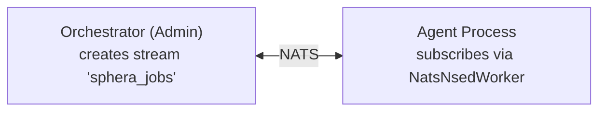
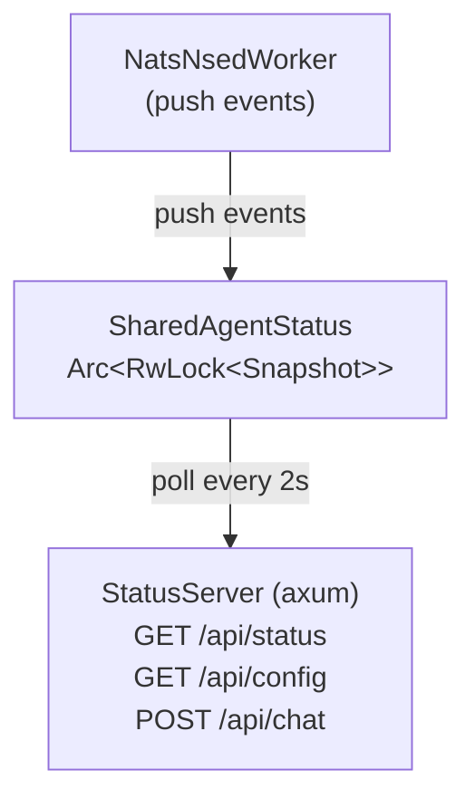

# Agent internals

This document covers the internal architecture of the `quorum-rs` crate for developers who want to use it as a Rust library or understand how the reference agent works under the hood.

For running an agent from the CLI, install the `quorum` binary via `cargo install quorum-rs` — the CLI ships in the same crate as the SDK.

## Library Quick Start

```rust
use quorum_rs::agents::{AgentConfig, ProposerEvaluatorAgent};
use quorum_rs::llms::OpenAICompatibleModel;
use quorum_rs::prompts::defaults::DefaultPromptSet;
use quorum_rs::workers::{NatsNsedWorker, NatsNsedWorkerExt, WorkerConfig};

#[tokio::main]
async fn main() -> anyhow::Result<()> {
    // 1. Configure the agent
    let agent_config = AgentConfig {
        name: "my-agent".into(),
        provider_id: "together_ai".into(),
        model_name: "MiniMaxAI/MiniMax-M2.5".into(),
        ..Default::default()
    };

    // 2. Build LLM backend
    let model = OpenAICompatibleModel::new(
        "https://api.together.xyz/v1".into(),
        std::env::var("TOGETHER_AI_API_KEY").unwrap(),
        None,
    );

    // 3. Create the agent with default prompts
    let agent = ProposerEvaluatorAgent::new(
        agent_config,
        Box::new(model),
        Box::new(DefaultPromptSet::new()),
        vec![],  // propose-phase tools
        vec![],  // evaluate-phase tools
    );

    // 4. Connect to NATS and start processing tasks
    let config = WorkerConfig::new(
        "nats://localhost:4222".into(),
        "sphera_jobs".into(),
        "my_agent_consumer".into(),
    );

    // from_agent() auto-wires extensions (user tool handler, chat support)
    let worker = NatsNsedWorker::from_agent(agent, config).await?;
    worker.run().await
}
```

## Architecture

The orchestrator and agent are decoupled over NATS JetStream:



| Direction | Subject | Purpose |
|-----------|---------|---------|
| Orchestrator → Agent | `nsed.{session}.task.{agent}.propose` | Dispatch propose task |
| Orchestrator → Agent | `nsed.{session}.task.{agent}.evaluate` | Dispatch evaluate task |
| Agent → Orchestrator | `nsed.{session}.result.{round}.{agent}.{action}` | Publish result |
| Orchestrator → All | `nsed.jobs.manifest.{job_id}` | Broadcast job manifest |
| Agent → Orchestrator | `nsed.jobs.ack.>` | Acknowledge manifest |

The orchestrator can run **without any agents**. Agents can **join and leave at any time** — the orchestrator dispatches tasks to whichever agents are online.

## Modules

| Module | Key Types | Purpose |
|---|---|---|
| `agents` | `ProposerEvaluatorAgent`, `UserToolHandler`, `NatsUserToolHandlerFactory` | ReAct-style agent with tool-use loop + direct `chat()` method + `ChatCapable` impl |
| `providers` | `ProviderFactory`, `ProviderRegistry`, `cli_base` | Dispatch registry mapping `provider.type` → factory that builds the agent (third parties register their own); `cli_base` holds the exec/mcp shared subprocess spawn + timeout helpers. See [About the provider registry](provider-registry.md). |
| `llms` | `OpenAICompatibleModel`, `RateLimiter` | LLM client (any compatible API) with streaming + rate limiting |
| `llms::strategies` | `NativeStrategy`, `HarmonyStrategy`, `XmlRegexStrategy` | Provider-specific request/response adaptation |
| `llms::simulated` | `SimulatedModel` | Deterministic model for testing |
| `prompts` | `DefaultPromptSet` | Benchmark-validated XML-structured prompts |
| `tools::context` | `ReadProposalTool`, `ReadCritiquesTool`, `ReadOwnProposalTool` | RAG tools for reading deliberation history |
| `tools::sandbox` | `ListFilesTool`, `ReadFileTool`, `WriteFileTool`, `ExecuteCommandTool` | Sandboxed execution tools |
| `tools::user_call` | `UserCallTool` | External tool forwarding via NATS KV |
| `llm_repair` | `repair_tool_calls`, `extract_xml_tool_calls`, `strip_thinking_prefix`, ... | Multi-stage JSON repair for unreliable model output (6 stages: truncation repair → escape repair → lossy sanitization → conversational/markdown extraction → merged field splitting → thinking-token prefix stripping) |
| `workers` | `NatsNsedWorker`, `WorkerConfig`, `NatsScratchpadStore`, `JobManifest`, `NatsNsedWorkerExt`, `NatsNsedWorkerStatusExt` | NATS JetStream worker runtime + ergonomic extension traits |
| `status` | `AgentStatusSnapshot`, `EventLogEntry`, `SharedAgentStatus` | Real-time agent status types |
| `status::server` | `StatusServer` | Embedded HTTP dashboard with chat + config API (feature: `status-server`) |

## How the Agent Works

The `ProposerEvaluatorAgent` implements the `NsedAgent` trait with two main methods, plus a direct chat method:

1. **`propose(ctx)`** -- Generates a solution proposal:
   - Runs a ReAct loop: system prompt -> tool calls -> observations -> ... -> final answer
   - Uses `generate_structured_output` to extract JSON from the model's response
   - Supports context tools (read previous proposals, critiques) and user-defined tools

2. **`evaluate(ctx)`** -- Evaluates peer proposals:
   - Receives all proposals from the current round via `AgentContext`
   - Uses batch evaluation prompts to score each proposal
   - Returns evaluations with scores, justifications, structured claim assessments, disagreement points, stance, and per-category quality scores
   - Extensive serde alias coverage handles LLM field-name hallucination (11+ aliases per field)

3. **`chat(messages)`** -- Direct conversation with the agent's LLM:
   - Bypasses the NSED deliberation protocol entirely
   - Uses the agent's persona with an `<internal_voice>` wrapper that signals the LLM to respond naturally
   - Accepts a full conversation history (`Vec<ChatCompletionRequestMessage>`)
   - Used by the dashboard chat interface (`POST /api/chat`)

## NATS Worker Lifecycle

1. **Connect** -- `NatsNsedWorker::new()` connects to NATS and creates per-agent KV buckets for idempotency and scratchpad storage.
2. **Subscribe** -- Binds durable pull consumers for task and manifest subjects.
3. **Manifest ACK** -- When the orchestrator broadcasts a job manifest listing this agent, the worker sends an `agent_accepted` event.
4. **Task Processing** -- For each incoming task:
   - Deduplicates via idempotency KV bucket
   - Publishes `agent_working` SSE event
   - Attaches `NatsScratchpadStore` for persistent memory
   - Runs `propose` or `evaluate` based on the action in the subject
   - Publishes result (or `agent_error` on failure)

## Status Dashboard & Event Log

The `status` module provides real-time agent monitoring, gated behind the `status-server` feature flag.

### Architecture



- **`AgentStatusSnapshot`** — Shared state with identity, counters, current job, recent tasks (max 20), and event log (max 200 entries). Defined in `quorum-rs`.
- **`EventLogEntry`** — Timestamped lifecycle event (`event_type`, `job_id`, `detail`). Defined in `quorum-rs`.
- **`StatusServer::run(port, status, chat_agent, agent_config)`** — Spawns an embedded axum HTTP server. Uses `Option<Arc<dyn ChatCapable>>` for chat support.

### Event Types

The worker pushes events at each lifecycle transition:

| Event | When | Detail |
|-------|------|--------|
| `connected` | Worker starts listening | `"NATS connected, listening for tasks"` |
| `agent_accepted` | Manifest received, agent selected | `"Accepted job manifest ({task})"` |
| `agent_working` | Task execution begins | `"Round {n} {action}"` |
| `task_complete` | Task finishes successfully | `"{action} ok {ms}ms"` |
| `agent_error` | Task fails | `"{action} failed: {error}"` |
| `heartbeat` | Every 10s | `"idle  uptime {n}s"` or `"busy  uptime {n}s"` |

### Chat API

The `POST /api/chat` endpoint accepts `{ messages: [{ role, content }] }` and forwards the conversation to `agent.chat()`. The system prompt includes the agent's persona with an `<internal_voice>` block that bypasses NSED deliberation constraints.

## LLM Strategies

The `OpenAICompatibleModel` delegates provider-specific quirks to strategy implementations:

| Strategy | When Used | What It Does |
|---|---|---|
| `NativeStrategy` | Default for most providers | Standard tool calling API, handles Cloudflare/vLLM/Together quirks |
| `HarmonyStrategy` | gpt-oss via `harmony` engine | Encodes tool schemas into system prompt for models without native tool support |
| `XmlRegexStrategy` | vLLM with `guided_regex` | Uses XML-based tool calling with regex-guided decoding |

## Rust Configuration Types

### `AgentConfig`

```rust
AgentConfig {
    name: "my-agent".into(),           // Unique agent identifier
    provider_id: "together".into(),     // Provider for strategy selection
    model_name: "meta-llama/...".into(), // Model identifier
    max_iterations: 10,                 // Max ReAct loop iterations
    context_window: 128_000,            // Max context tokens
    temperature: Some(0.7),             // Sampling temperature
    task_precision: TaskPrecision::Standard, // Controls structured output strictness
    ..Default::default()
}
```

### `WorkerConfig`

```rust
WorkerConfig::new(
    "nats://localhost:4222".into(),   // NATS server URL
    "sphera_jobs".into(),             // JetStream stream name
    "agent_consumer".into(),          // Durable consumer name
)
.with_subject_prefix("nsed".into())    // Subject namespace (default: "nsed")
.with_scratchpad_retention(86400 * 7)  // Scratchpad TTL in seconds (default: 7 days)
```

## Trait / implementation map

The agent contract is defined by traits in `quorum_rs::agents` and friends. The reference implementations shipped in this crate map as follows:

| Trait | Reference impl |
|---|---|
| `NsedAgent` | `ProposerEvaluatorAgent` |
| `AiModel` | `OpenAICompatibleModel`, `SimulatedModel`, `SimpleOpenAIModel` |
| `PromptSet` | `DefaultPromptSet` |
| `Tool` | `ReadProposalTool`, `UserCallTool`, sandbox tools, … |
| `UserToolHandlerTrait` | `UserToolHandler` |
| `UserToolHandlerFactory` | `NatsUserToolHandlerFactory` |
| `ChatCapable` | `ProposerEvaluatorAgent` (via `impl ChatCapable`) |
| `ChatStrategy` | `NativeStrategy`, `HarmonyStrategy`, `XmlRegexStrategy` |

Custom agents can implement `NsedAgent` directly. To start from a ready-made ReAct loop with rate-limited LLM access, default prompts, and built-in tools, use `ProposerEvaluatorAgent` (see [`how-to/agent-development.md`](../how-to/agent-development.md)).
