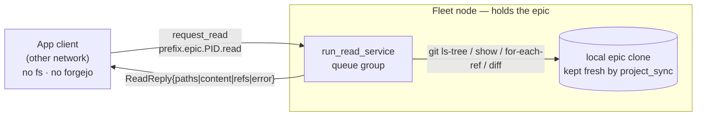

# About the epic-read bridge

Git-based patch deliberation produces two audit planes. This article explains why the
app client can see only one of them without help, why the missing plane travels over
NATS instead of git, how a read stays confined to one epic, and why "can talk to the
agents ⇒ can read their epic" is the whole authorization model.

## Two planes, one reachable

A patch deliberation leaves its record in two places:

- **Deliberation plane** — prose proposals + scores, served by the orchestrator's
  `/details` API. This is HTTP; a client on any network reads it.
- **Patch plane** — the epic git repo itself: `job/<job>/<agent>` proposal branches,
  `base/<job>` / `head/<job>` audit tags, and the diffs between them. This is the
  content-addressed, PIJUL-on-git record of *what changed*, not just what was argued.

The patch plane lives on the fleet nodes' filesystems and in forgejo. The app client
runs on a different network: **no filesystem access to the worktrees, no forgejo
credentials, no route to clone.** So a client that reads `/details` fine still cannot
see a single branch, tag, or hunk of the patch plane. Cloning is not an option — there
is nothing for it to clone against.

## Why NATS, not a clone

The client already reaches the fleet over NATS (that is how deliberation runs at all).
A fleet node that *does* hold the epic can answer the client's read requests from its
own local clone. NATS is the only shared channel between the two networks, so the bridge
is request/reply over NATS rather than "give the client a repo URL."

The client issues `request_read`; a node holding the project answers from `git ls-tree`
/ `git show` / `git for-each-ref` / `git diff`. The reply carries a file listing, file
or diff content, a ref list, **or** a structured `error` — never a silent timeout. With
the refs and diffs the client reconstructs the BranchGraph and derives hunks by
content-addressing, all without a clone.

## Subject and scope: authz by reachability

Each project is served on `"<prefix>.epic.<project_id>.read"`, where `project_id` is the
epic's root-commit key — the same identity
[`ProjectRegistry`](../../crates/quorum-rs/src/project_registry.rs) groups agents on and
`patch_deliberation::project` derives. Putting the project id in the subject makes NATS
the authorization layer, on two sides:

- **Serving side** — a node runs `queue_subscribe("<prefix>.epic.*.read")` and, per
  request, refuses any `project_id` not in its `held` map (`serve_scoped`). It answers
  only for epics it actually holds; a stray request is refused, never served from the
  wrong epic. The queue group means exactly one holder replies.
- **Requesting side** — the client's NATS identity scopes which project subjects it may
  publish to.

Together these give the intended rule: **a client can read epic X iff it can reach an
agent that holds X.** Sharing the deliberation channel with the agents *is* the grant —
"talk to the agents that share that filesystem, by id, and you can see the dir." There
is no separate ACL to keep in sync; the epic identity and the NATS route are the ACL.

## Confinement

Every op is read-only and confined to the epic tree. `git show <ref>:<path>` is already
repo-relative (it resolves against the tree, never the filesystem), but the bridge
fails **closed before** touching git: `reject_unsafe_path` rejects absolute paths, a
leading `/`, any `..` component, and backslashes. So an escape attempt (`../../etc/passwd`)
is an explicit, tested error rather than a surprising git message — and confinement is an
invariant the tests assert over the wire, not an accident of git's behaviour. Git env
(`GIT_DIR` / `GIT_WORK_TREE` / `GIT_INDEX_FILE`) is scrubbed on every call so an ambient
`GIT_DIR` can't redirect a read off the epic (the same isolation `project_sync` uses).

## Freshness: no extra fetch

Reads reflect the epic's **current** git state — `serve_read` shells straight to git, so
the moment a deliberation commit lands the next read returns it. On a fleet node the
served clones are the same ones
[`project_sync`](../../crates/quorum-rs/src/project_sync.rs) keeps current: it pulls on
each `project_advanced` event. The read service reads those clones directly, so
"updates when deliberation runs" needs no bespoke refresh path — the pull the client
sync loop already does is what the read service observes.

## Wiring: which epics a node serves

`serve_fleet` discovers held epics from the fleet config, not from a separate setting.
`held_epics_from_fleet` scans every agent's dylib middleware for a
`patch_deliberation.upstream` path (the epic root the dylib operates on), keys each by
`project_id_of`, and dedups agents that share one upstream. If any epic is held, serve
connects NATS and spawns `run_read_service` for the fleet's lifetime, aborting it when
the runner is cancelled. A `upstream` path that isn't a readable git epic is skipped and
logged — a misconfigured upstream disables the bridge for that epic rather than failing serve.

## What the bridge is not

- **Not a write path.** Every op is read-only; proposals still flow through the
  deliberation pipeline, never this bridge.
- **Not a replacement for `/details`.** The prose/score plane stays on HTTP; this bridge
  is only the git patch plane the client otherwise can't see.
- **Not a general file server.** It serves exactly the epics the node holds, scoped by
  project id, confined to each tree.
