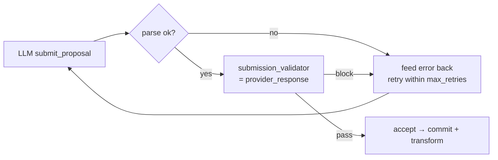

# Middleware

NSED agents support a pluggable middleware system for validation, transformation, and moderation at key lifecycle points. Middleware runs as a sequential pipeline — each middleware sees the (potentially transformed) output of the previous one.

## Middleware Points

| Point | When | Use Cases |
|-------|------|-----------|
| `before_release` | Before buffer entry is published to NATS | Content moderation, signature verification, sanitization |
| `on_provider_response` | After LLM returns, before buffer entry creation | Response transformation, format repair, raw logging |
| `before_prompt` | Before constructing the LLM prompt | PII redaction, context injection |
| `on_completion` | After deliberation result is finalized | Export, notification, result transformation |
| `on_job_complete` | Once at job-final (orchestrator `job_complete` event) | Winner-merge side effects, per-agent finalization |

The `before_release` point has two stages:
- **Edit stage**: runs on buffer edits (lightweight, early feedback)
- **Release stage**: runs on buffer release (full validation gate)

## Verdicts

Each middleware returns one of three verdicts:

| Verdict | Effect |
|---------|--------|
| `pass` | Proceed (optionally with transformed content) |
| `warn` | Proceed but annotate for audit trail |
| `block` | Reject — entry stays in buffer, API returns 422 |

### Reviewer block feeds the agent's react loop

A `block` at the `on_provider_response` stage of a **propose** task is not fatal.
The worker injects the `on_provider_response` pipeline as the agent's
`submission_validator`, so it runs **inside the react loop** on every
`submit_proposal`. A block converts the accepted submission into a retry, feeding
the reason back to the model as a `SYSTEM ERROR` — reusing the **same** retry
budget (`max_retries`) that handles malformed submissions, not a separate one.
This lets a reviewer (e.g. patch-deliberation rejecting a proposal that applies
**zero** changes, or leaves any op unresolved) hand the agent actionable feedback
in-loop.

The validation is idempotent: patch-deliberation's `provider_response` discards
any uncommitted residue at the start, so running it per attempt inside the loop
**and** once more for the accepted proposal's commit + content transform composes
correctly. Only when the react loop exhausts `max_retries` does the block surface
as a task error.



## Configuration

```yaml
middleware:
  before_release:
    - builtin: rule_based
      stages: [edit, release]
      config:
        max_content_length: 50000
        pii_patterns: true
    - binary: ./middleware/moderate
      timeout_secs: 30
      stages: [release]
    - builtin: llm_moderation
      stages: [release]
      config:
        provider_id: safety_llm
        model_name: gpt-4o-mini
        categories: [harassment, hate_speech, nsfw, pii]

  on_provider_response:
    - binary: ./middleware/transform_response
      timeout_secs: 10
```

## Binary Middleware Protocol

External binaries communicate via stdin/stdout JSON:

| Direction | Format | Description |
|-----------|--------|-------------|
| stdin | JSON `MiddlewareContext` | Content, action, agent_id, job_id, round, stage, metadata |
| stdout | JSON `MiddlewareVerdict` | `{ verdict, content?, reason?, category? }` |
| exit 0 | — | Pass (if no JSON on stdout) |
| exit non-zero | — | Block (stderr used as reason) |
| timeout | — | Block with "Middleware timed out" |

### Example: Python moderation script

```python
#!/usr/bin/env python3
import json, sys

ctx = json.load(sys.stdin)
content = json.dumps(ctx["content"])

if "badword" in content.lower():
    json.dump({
        "verdict": "block",
        "category": "content_policy",
        "reason": "Contains prohibited content"
    }, sys.stdout)
else:
    json.dump({"verdict": "pass"}, sys.stdout)
```

### Example: Shell validation script

```bash
#!/bin/bash
# Block content longer than 100KB
SIZE=$(wc -c < /dev/stdin)
if [ "$SIZE" -gt 102400 ]; then
    echo '{"verdict":"block","category":"size","reason":"Content exceeds 100KB"}'
else
    echo '{"verdict":"pass"}'
fi
```

## Dynamic Library (FFI) Middleware

For performance-critical middleware (no subprocess overhead), load a `.so`/`.dylib`/`.dll`:

```yaml
middleware:
  before_release:
    - dylib: ./middleware/libcheck.so
      stages: [release]
```

The library must export a C function:

```c
int32_t nsed_middleware_execute(
    const uint8_t *ctx_json,    // JSON MiddlewareContext
    uint32_t       ctx_len,
    uint8_t       *out_buf,     // buffer for JSON MiddlewareVerdict
    uint32_t       out_buf_len,
    uint32_t      *out_len      // actual bytes written
);
// Return: 0 = success, 1 = block, -1 = error
```

**Fail-closed loading.** If a configured middleware cannot be built — a dylib
that won't load or resolve `nsed_middleware_execute`, or a builtin that fails to
construct — agent startup **aborts** rather than silently running without the
guard. A moderation or validation stage you configured can never be quietly
dropped because of a load error: either it is in the pipeline, or the agent
doesn't start. (Fail-open loading would silently disable exactly the guard you
asked for, at the moment it's most likely to matter.)

### Example: Rust cdylib

```rust
// Cargo.toml: [lib] crate-type = ["cdylib"]
#[no_mangle]
pub extern "C" fn nsed_middleware_execute(
    ctx_json: *const u8, ctx_len: u32,
    out_buf: *mut u8, out_buf_len: u32, out_len: *mut u32,
) -> i32 {
    let ctx = unsafe { std::slice::from_raw_parts(ctx_json, ctx_len as usize) };
    // Parse, validate, write verdict to out_buf...
    let verdict = br#"{"verdict":"pass"}"#;
    unsafe {
        std::ptr::copy_nonoverlapping(verdict.as_ptr(), out_buf, verdict.len());
        *out_len = verdict.len() as u32;
    }
    0
}
```

FFI middleware runs on a blocking thread (`spawn_blocking`) to avoid blocking the tokio runtime.

## Structured-output enforcement (middleware-declared schema)

A `before_prompt` middleware can constrain the agent's **proposal submission** to a
JSON schema, forcing the model to return a schema-shaped structured object instead
of free prose (e.g. patch-deliberation's `{rationale, ops}` envelope). This removes
the reliance on the agent *voluntarily* emitting valid JSON.

**Declaring the schema.** The `before_prompt` verdict returns a `proposal_schema`
field (a JSON Schema object) alongside the transformed `task_description`:

```json
{ "task_description": "…injected prompt…",
  "proposal_schema": {
    "type": "object",
    "properties": { "rationale": {"type": "string"}, "ops": {"type": "array"} },
    "required": ["rationale", "ops"] } }
```

The worker threads it to `AgentContext.forced_proposal_schema`. Enforcement then
depends on the provider path:

| provider path | mechanism |
|---|---|
| OpenAI / native | the schema becomes the `submit_proposal` tool's `parameters` **and** the request sets `tool_choice: required` — the model must return a schema-valid tool call |
| Claude / MCP (subprocess) | `NsedMcpServer::list_tools` nests the schema into the advertised `nsed_propose` `input_schema`; a forceful `MissingTerminalCall` retry drives the submission |

The tool-call arguments become `Proposal.content` verbatim, so an
`on_provider_response` middleware receives the guaranteed-shaped object.

**Scope + caveats:**
- Generic — any middleware may declare any schema; not patch-deliberation-specific.
- The SDK treats the payload as **opaque** (it never parses the envelope) — parsing
  is the declaring middleware's job. So a forced proposal's `thought_process` is
  empty; the substance lives in `content`.
- OpenAI is a **hard** guarantee (`tool_choice: required`); Claude/MCP is
  schema-guided + retry-forced (the `claude` CLI exposes no tool-choice flag).
- **No enforcement** when the agent runs with `disable_native_tools` (XML/Nous
  models) — the request can't carry `tool_choice`.

## Builtin Middleware

Builtin types are compiled into the binary:

| Type | Description | Default Stages |
|------|-------------|----------------|
| `rule_based` | Regex blocklist, content length limits, PII detection (email, phone, SSN, credit card), binary data rejection | edit + release |
| `llm_moderation` | LLM-based content classification against configurable categories (harassment, hate speech, NSFW, prompt injection) | release |
| `prompt_exposure` | Blocks LLM output that leaks the agent's own system prompt (internal XML tags, protocol phrases) or the canonical tool registry. See [below](#prompt_exposure-config). | provider_response |
| `signature_verification` | Cryptographic signature validation — requires #115 (crypto crate). Currently pass-through. | release |

### `rule_based` Config

```yaml
- builtin: rule_based
  stages: [edit, release]
  config:
    blocklist:                    # Inline regex patterns (optional)
      - "forbidden_word"
      - "\\bsecret_key\\b"
    blocklist_file: config/blocklist.txt  # One regex per line (optional)
    max_content_length: 50000     # Block if > N chars (default: 50000, 0 = no limit)
    pii_patterns: true            # Enable PII detection (default: true)
    binary_detection: true        # Block control/binary chars (default: true)
```

PII detection produces `Warn` (annotate but allow). Blocklist matches produce `Block`.

### `llm_moderation` Config

```yaml
- builtin: llm_moderation
  stages: [release]
  config:
    categories:                   # Categories to check (default: harassment, hate_speech, nsfw, prompt_injection)
      - harassment
      - hate_speech
      - nsfw
      - prompt_injection
    on_warning: annotate          # "annotate" (proceed + flag) or "block" (treat warns as blocks)
    max_moderation_length: 10000  # Truncate content before sending to LLM (default: 10000)
```

The LLM is prompted with a structured JSON request and returns per-category verdicts. Aggregation: any "block" → Block, any "warn" → Warn/Block (based on `on_warning`), all "pass" → Pass. Parse failures → Block (fail-closed).

### `prompt_exposure` Config

Blocks LLM responses that leak the agent's **own** system prompt structure or tool registry. Catches the failure modes observed in production:

- **XML tag leakage** — the model echoes structural tags from its system prompt (`<working_memory>`, `<key_findings>`, `<strategy>`, `<scratchpad>`, `<peer_critiques>`, `<deliberation_brief>`, …) into user-facing content.
- **Tool-name leakage** — the model names internal orchestrator tools (`submit_proposal`, `submit_batch_evaluation`, `read_proposal`, `read_critiques`, `read_own_proposal`, `search_deliberation`, `update_scratchpad`) in prose the user will read.
- **Wrong-acronym leakage** — the model invents an NSED expansion other than the canonical `N-Way Self-Evaluating Deliberation`. Observed hallucinations in prod include `Neural Swarm`, `Neural-Swarm-Enabled Deliberation`, `Natural Semantic Evolution/Deliberation`, `Neural Swarm Ensemble Deliberation`. Matched case-insensitively. Any hit is a definitive leak, since the whitepaper fixes the canonical expansion; operators can extend the list via `extra_known_wrong_acronyms` as new hallucinations appear in telemetry.

Also detects a small set of meta-protocol phrases (`Proposing Phase`, `Evaluating Phase`, `Cooperative Failure`, `Competitive Success`, `deliberation_rounds`) that only belong inside the system prompt.

> nsed = **n-way-self-evaluating deliberation**. Its mechanics are internal to the platform and should never be explained or named in a final answer.

Default stage: `provider_response` (after the LLM returns, before buffer entry creation).

```yaml
- builtin: prompt_exposure
  # Omit `stages:` to inherit the `on_provider_response` default.
  config:
    # --- Indicator lists ---
    # Override the full XML-tag list (replaces defaults entirely). Most
    # deployments want `extra_xml_tags` instead.
    # xml_tags: ["working_memory", "key_findings", ...]
    extra_xml_tags: ["custom_protocol_tag"]

    # Override or extend the canonical tool-name list.
    # tool_names: ["submit_proposal", "read_proposal", ...]
    extra_tool_names: ["my_private_tool"]

    # Override or extend the instruction-phrase list.
    # instruction_phrases: ["Proposing Phase", ...]
    extra_instruction_phrases: ["vector alignment protocol"]

    # Override or extend the list of hallucinated acronym expansions.
    # Matched case-insensitively. Defaults are detector-specific —
    # consult your `OutputLeakDetector` implementation.
    # known_wrong_acronyms: ["Foo Bar", ...]
    extra_known_wrong_acronyms: ["Some Other Hallucinated Expansion"]

    # --- Trigger gates ---
    # Number of distinct indicator matches required to block. Default 1 —
    # a single canonical tag or tool name is already a strong signal.
    min_matches: 1

    # Skip scanning entirely when the answer is shorter than this many
    # characters. Short confirmations that incidentally name a tool are
    # usually intentional. Default 0 (scan every length).
    min_answer_length_chars: 0

    # Length-aware suspicion score. A hit inside a long explanatory
    # paragraph is weighted more heavily than the same hit in a one-line
    # reply, because a long answer provides more surface area for the
    # model to have chosen wording that happens to collide with an
    # internal identifier. Default 0.0 — any hit above `min_matches`
    # blocks, regardless of score. Raise to e.g. 2.0 to require either
    # multiple hits or a long-enough answer.
    #
    # Formula: score = hits * log2(1 + len / suspicion_length_unit_chars)
    # With the default unit=200, a 200-char answer with 1 hit scores 1.0,
    # a 1800-char answer with 1 hit scores ~3.3, a 200-char answer with
    # 3 hits scores 3.0.
    min_suspicion_score: 0.0
    suspicion_length_unit_chars: 200

    # --- Block-reason content ---
    # Include the sanctioned nsed explainer in the block reason so the
    # retrying model has a drop-in replacement for the leaked content.
    # Default true.
    include_explainer_in_reason: true

    # Override the built-in explainer text. Leave unset to use the
    # tested default (game-theoretic + architecture framing, no internal
    # scaffolding references).
    # nsed_explainer: "Your custom approved description."
```

**Verdicts**: a response blocks when `hits >= min_matches` **and** `suspicion_score >= min_suspicion_score` **and** the answer length is at least `min_answer_length_chars`. Block category is `prompt_exposure`. The reason string names the first few indicators found (capped), reports the suspicion score, and optionally carries the sanctioned nsed explainer so downstream layers and retrying models have a safe replacement.

**Suspicion score intuition**: the score `hits * log2(1 + len / unit)` grows with both hit count and answer length. This models the observation that a long response mentioning a canonical identifier has more ways to have avoided it — so the same indicator there is stronger evidence of a genuine leak than in a tight one-liner.

**Approved nsed explainer**: the default explainer is the published [nsed whitepaper](https://arxiv.org/abs/2601.16863) abstract, preceded by the paper URL. It covers the Runtime Mixture-of-Models architecture, the Dynamic Expertise Broker, the Macro-Scale RNN execution model, the Quadratic Voting consensus activation, and the empirical + DarkBench results — all externally shareable content that does not name any internal XML tag, tool, or phase identifier. Operators with tenant-specific phrasing can override via `nsed_explainer`.

**False-positive design**: the XML matcher requires `<tag>` angle-bracket form, so prose like "our strategy" does not hit; the tool-name matcher uses a snake_case-aware delimiter class, so user phrases like "read proposal" (space) or embedded identifiers like `my_submit_proposal_runner` do not hit.

**Keeping defaults in sync**: detectors that ship with default tag/tool-name lists need updating when you add a new prompt-internal XML section or a new orchestrator tool — otherwise the guardrail silently lets the new leak through.

#### Per-agent `prompt_exposure_guard` (wired into the agent loop)

Independently of the YAML middleware pipeline, `AgentConfig` now carries a `prompt_exposure_guard: bool` flag that, when `true`, wires the `prompt_exposure` middleware directly into `generate_structured_output`:

```yaml
agents:
  - name: CortexA
    provider_id: openrouter
    model_name: google/gemma-4-26b-a4b-it
    # ... other settings ...
    prompt_exposure_guard: true   # ← enables the in-loop guardrail
```

When enabled, after every successful terminal tool-call parse the agent loop scans only the **user-visible** fields:

- `submit_proposal` → `solution_content`
- `submit_batch_evaluation` → every `evaluations[].justification` + each `claim_assessments[].reason` (the `ClaimAssessment` struct declares serde aliases `disagreement` / `explanation` / `reasoning` so off-schema keys are normalised into `reason` at deserialize time; the guard only ever reads the canonical key)
- any other terminal tool → full serialized JSON (fail-closed fallback)

`thought_process` is intentionally skipped — that's internal reasoning, never surfaced to the user.

**The guard is a post-recovery sanitizer, not a retry trigger.** It runs *only* after format recovery has produced a parseable result (`parse_result.is_ok()`), so it can never mask a genuine parse error and never consumes the format-recovery retry budget. This ordering is deliberate: if the recovery tooling turns a malformed tool-call into valid structured output, the guard scans that clean output — not the recovery artifacts — so honest content stops tripping the detector.

On a block, the loop **redacts** the leaked indicators (`redact_terminal_leak`) out of the user-visible fields — each matched XML tag, tool name, instruction phrase, and wrong-acronym is replaced with `[redacted]` while surrounding prose is preserved — and lets the sanitized content through. The deliberation continues instead of hard-failing after N retries. Redaction runs to a fixpoint so adjacent tool names (whose shared boundary char one regex pass would swallow) are all cleared; the post-condition is `scan(redacted).hit_count() == 0`. A `PromptExposureDetected { blocked: true, … }` telemetry event still fires with the full per-category hit counts for false-positive-rate tracking.

If a redacted value somehow fails to re-deserialize into the terminal type (should not happen for known tools — a `[redacted]` string is still a valid string field), the loop logs a warning and passes the original content through (fail-open) rather than crashing the agent.

The `OutputLeakDetector::redact` method backs this: the default trait impl is identity (fail-open) so detectors without redaction keep pass-through behaviour; `PromptExposureMiddleware` overrides it with the fixpoint scrub described above.


### Recommended Pipeline Order

```yaml
middleware:
  before_release:
    # 1. Signature check — free, catches unsigned early
    - builtin: signature_verification
      stages: [release]
    # 2. Rule-based — fast regex, catches obvious violations
    - builtin: rule_based
      stages: [edit, release]
      config:
        blocklist_file: config/blocklist.txt
        max_content_length: 50000
        pii_patterns: true
    # 3. Custom binary (optional) — domain-specific
    # - binary: ./middleware/domain_rules
    #   timeout_secs: 10
    #   stages: [release]
    # 4. LLM moderation — expensive, runs last
    - builtin: llm_moderation
      stages: [release]
      config:
        categories: [harassment, hate_speech, nsfw, prompt_injection]
        on_warning: annotate
  on_provider_response:
    # Scan the LLM output the moment it arrives. Catches prompt/tool leaks
    # before the content enters the buffer, triggering a retry instead of
    # requiring human intervention.
    - builtin: prompt_exposure
```

Rationale: signature (free) → rules (µs) → binary (ms) → LLM (seconds, $). Each layer is a filter — cheaper checks reject early, saving LLM costs.

## Pipeline Behavior

- Middleware execute in declaration order
- Short-circuits on first `Block` verdict (subsequent middleware don't run)
- `Warn` verdicts accumulate — all are returned alongside the final `Pass`
- Content transformations flow through: middleware B sees middleware A's modified content
- `hook_state` map allows inter-middleware communication (ephemeral per pipeline run)
- All middleware runs are non-blocking — failures in optional middleware don't fail the agent

## API Response on Rejection

```text
HTTP/1.1 422 Unprocessable Entity
Content-Type: application/json

{
  "error": "Content rejected by middleware",
  "category": "harassment",
  "reason": "Content violates community guidelines",
  "middleware": "llm_moderation"
}
```

## Design Influences

Inspired by LangChain v1's middleware architecture, adapted for NSED's buffer-based HITL flow:

- **Binary middleware** (stdin/stdout JSON) — any language, not Python-only
- **`Verdict::Warn`** — proceed but annotate (LangChain lacks this)
- **Stage filtering** (edit vs release) — early/late feedback
- **Sequential pipeline** — simpler than graph-based composition
