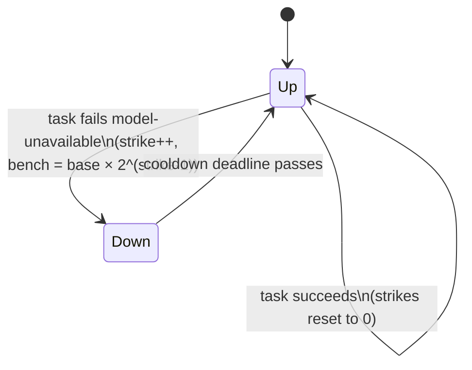

# About model-down benching

When an agent's remote model goes away — a removed endpoint, a decommissioned
model id, a provider returning `404 Not Found` — every task routed to that agent
fails the same way. Left unchecked, the scheduler keeps handing that agent work
it cannot do, and each job it joins loses a candidate. In the worst case a job
collapses to a single proposer, or to none.

Benching is how an agent removes itself from scheduling until its model comes
back, without any central health-checker having to probe it.

## How it works

The agent's own task loop is the health signal. A task that fails with a
model-unavailable error (`is_model_down_error` — anchored on the HTTP status
phrase and known "model not found" messages, so a bare `404` inside a job id
does not trip it) arms a cooldown deadline. The heartbeat reports `model_down`
while the deadline is in the future, and the orchestrator's scheduler skips a
`model_down` agent. When the deadline passes the flag clears automatically, so a
*transient* outage does not bench the agent forever.

## Why the bench escalates

A fixed cooldown re-admits a *permanently*-dead model on every cycle: it is
benched, the deadline passes, the scheduler assigns it, the task 404s, it is
benched again — one failed job per cooldown, forever. In production this showed
up as a single agent joining seven jobs and proposing in none.

So the bench duration escalates with **consecutive** strikes —
`escalated_cooldown_ms` doubles the base per strike (5 min → 10 → 20 → …) capped
at 30 minutes. A chronically-dead model backs off toward the cap and stops
churning the scheduler; the operator has time to fix or remove it.

The escalation is fail-safe because **any successful task resets the strike
count to zero**. A model that recovers proves it by completing one task, and its
next (if any) failure waits only the base cooldown — the escalation never
punishes a working model, only a persistently-failing one.

## What benching is not

Benching is a scheduling hint, not a verdict. The orchestrator stays
reason-agnostic — it never learns *why* the agent is down, only that it should
not wait for it. The actual upstream error lives agent-side:
an operator reads it from `GET /api/agents/{name}/diagnostics`
(see [how-to: expose the agent dashboard](../how-to/expose-agent-dashboard-on-lan.md)),
where the `recent_errors` list carries the real `404` and the rising strike
count shows a model that is not recovering. Fixing or removing a chronically-
dead agent is the operator's call, not the orchestrator's.
