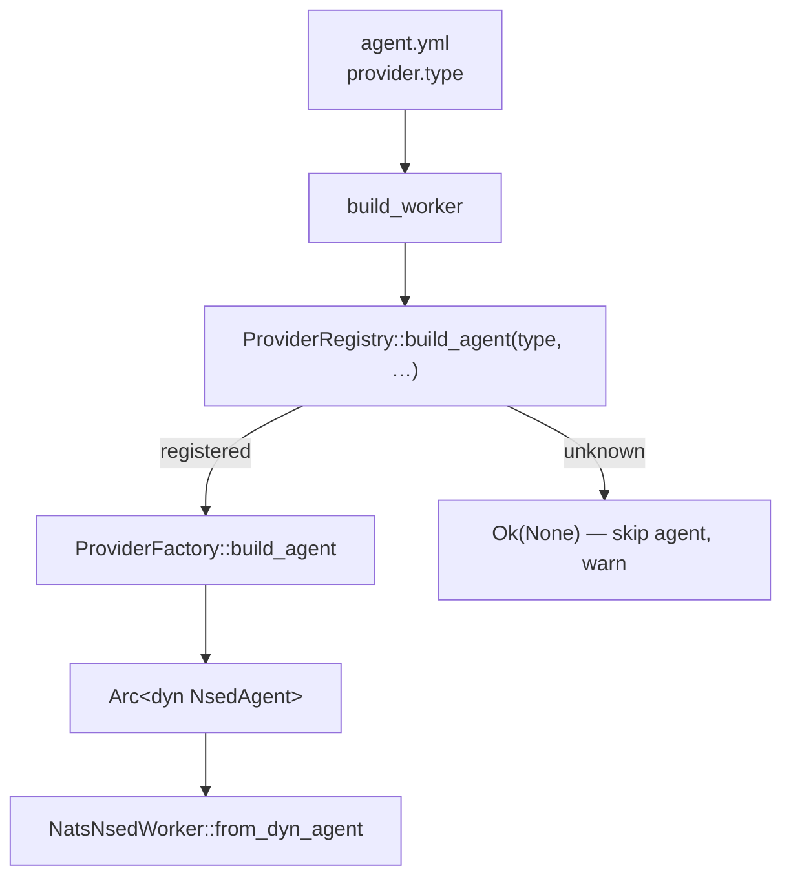

# About the provider registry

Why agent providers are a registry of factories rather than a hard-coded `match`, and what that buys a third-party crate.

## The problem it replaces

`quorum serve` turns each agent in a fleet config into a running NATS worker. Picking *which* agent implementation to build is driven by one string — `provider.type` in the YAML:

```yaml
providers:
  my_llm:
    type: openai        # ← dispatch key
    base_url: "https://api.openai.com/v1"
    api_key: "${OPENAI_API_KEY}"
```

Historically that dispatch was a `match provider.provider_type { "exec" => …, "mcp" => …, "claude" => …, _ => … }` inside `serve::build_worker`, and the "is this provider local, so it needs no API key?" question was a second, separate `matches!()` list in `config.rs`. Adding a provider type meant editing both, plus the construction plumbing — and a downstream crate could not add a provider type **at all** without forking the SDK.

## The shape now

Every provider is a [`ProviderFactory`](../reference/README.md). A [`ProviderRegistry`](../reference/README.md) maps `provider_type` → factory. `build_worker` does one lookup; the factory owns construction.



The trait is small:

```rust
pub trait ProviderFactory: Send + Sync {
    fn provider_type(&self) -> &str;
    fn requires_api_key(&self) -> bool { false }   // remote deployments only
    fn build_agent(
        &self,
        agent_config: &AgentConfig,
        provider: &ProviderEntry,
    ) -> Result<Option<Arc<dyn NsedAgent>>>;
}
```

### Two return signals

- `Ok(Some(agent))` — built; the worker boots.
- `Ok(None)` — **skip this agent cleanly**. The fleet keeps booting its other agents. Built-ins use this when a config section is missing (`provider_type=exec` with no `exec:` block) or unrecoverable (`ollama` with no `base_url`), having already logged *why*.
- `Err(_)` — surfaced as the worker-build error.

An unknown `provider_type` (typo, or a factory nobody registered) is itself an `Ok(None)` skip, with a warning that lists the registered set — the same fail-soft behaviour the old catch-all arm had.

### `requires_api_key` ⇒ `is_local`

`ProviderRegistry::is_local(type)` is `registered && !requires_api_key()`. This is the single source of truth for the placeholder-API-key exemption that used to be a hand-maintained `matches!("exec" | "mcp" | "claude" | …)`. A subprocess provider (`exec`, `mcp`, `claude`), local Ollama, and the simulator are local; `openai` is not.

## Built-in factories

`ProviderRegistry::with_builtins()` registers exactly the providers the old dispatch supported, with identical behaviour:

| `type` | Factory | Agent | `requires_api_key` |
|---|---|---|---|
| `exec` | `ExecFactory` | `ExecAgent` | no |
| `mcp` | `McpFactory` | `McpAgent` | no |
| `claude` | `ClaudeFactory` | `ClaudeAgent` | no |
| `openai` | `OpenAiCompatibleFactory` | `ProposerEvaluatorAgent` + `OpenAICompatibleModel` | **yes** |
| `ollama` | `OpenAiCompatibleFactory` | same | no |
| `simulated` | `OpenAiCompatibleFactory` | same | no |

The three OpenAI-wire-compatible types share one factory implementation, registered three times with the per-type `requires_api_key` flag. Only `openai` gets the `https://api.openai.com/v1` base-URL default; the others must set `base_url` explicitly (a guard so a typoed `type:` can't leak an API key to api.openai.com).

## Shared subprocess plumbing

`exec` and `mcp` both spawn an external process with piped stdio and a budget-derived timeout, then diverge completely — `exec` is one-shot stdin→stdout; `mcp` writes a line envelope and then runs a live MCP session over the same pipes. Only that spawn-and-timeout prologue is genuinely shared, so it lives in one place (`providers::cli_base`): `effective_timeout` (explicit `timeout_secs`, else phase budget, else 300s) and `spawn_child` (pipes + `kill_on_drop`, `working_dir`, `env`, then `extra_env` layered last for session-identity vars). The protocol halves stay in their own agents — the base is the overlap and nothing more, not a `use_mcp`-flag mega-struct that fuses two unrelated protocols.

`cli_base` is **public** — a third-party CLI-agent provider (a `codex` factory, say) reuses `spawn_child`/`effective_timeout` instead of reimplementing the spawn dance.

## Config without a core struct: `provider_config`

Built-in providers have typed config sections on `AgentConfig` (`exec:` / `mcp:` / `claude:`). A third-party provider can't add a field to that core struct without forking — so `AgentConfig` carries a generic `provider_config: HashMap<String, serde_yaml::Value>`. A factory deserializes the whole block into its own type with `AgentConfig::provider_config_as::<T>()`:

```rust
let cfg: CodexConfig = agent_config.provider_config_as()?;
```

The typed built-in sections (`exec:` / `mcp:` / `claude:`) remain — `provider_config` is an additional channel, not a replacement. The built-in `claude` provider also reads from it: `ClaudeFactory` falls back to `provider_config` when no typed `claude:` section is set (the typed section wins when present), so the generic path is exercised by a real shipping provider, not only custom ones.

## What a third party gets

A downstream crate implements `ProviderFactory` for its own type, registers it, and passes the registry to `serve_fleet` via `ServeOptions.registry` — no SDK change, no fork:

```rust
let mut registry = ProviderRegistry::with_builtins();
registry.register(Arc::new(MyCodexFactory));
serve_fleet(&fleet, ServeOptions { registry: Some(Arc::new(registry)), ..Default::default() }).await?;
```

`ServeOptions.registry == None` (the default) uses `with_builtins()`, so existing callers and YAML configs are unaffected.

See the [how-to](../how-to/register-a-custom-provider.md) for a complete working factory.
