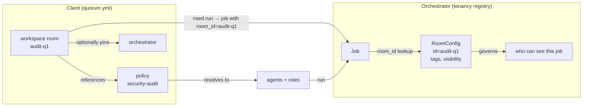
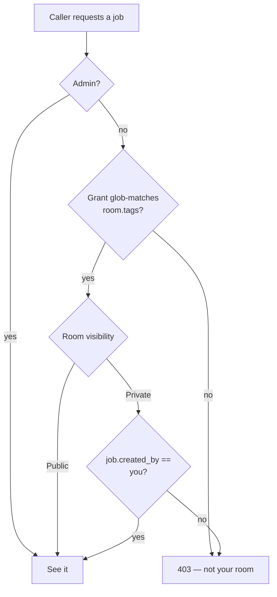

# Rooms & policies

This is an *explanation* document. It exists to help you build a correct mental
model of two concepts that are constantly confused in NSED: the **room** and the
**policy**. It is deliberately discursive — read it away from the keyboard. For
the precise field-by-field schemas, see the [glossary](../reference/glossary.md)
and the [run-an-agent-fleet how-to](../how-to/run-an-agent-fleet.md) (which shows
the `orchestrators` / `rooms` / `policies` blocks in `quorum.yml`). The
orchestrator-side tenancy registry (`RoomConfig`, visibility, `can_see_job`)
lives in the orchestrator service and its own docs.

The one-line version:

> A **policy** decides *who deliberates and how*. A **room** decides *where the
> job lives and who is allowed to watch it*. They are orthogonal, and the same
> policy is routinely reused across many rooms.

If you only remember one sentence, remember that one. The rest of this document
unpacks why the two are separate, why "room" is an overloaded word, and — most
importantly — where public vs. private rooms help you and where they will burn
you.

---

## Why two concepts at all?

A deliberation has two independent questions attached to it:

1. **What should happen inside it?** How many agents, which capabilities, how
   many rounds, how hard to push for consensus, what SLA timers apply. This is
   the *recipe*.
2. **Who is allowed to see it happen?** Only the person who submitted it? An
   audience? A whole operator tenant? This is the *access boundary*.

These two questions have nothing to do with each other. A "5 senior security
reviewers, 4 rounds, high effort" recipe is equally valid whether the result is
a private answer for one engineer or a live demo projected to a hundred people.
NSED keeps them apart on purpose: the recipe is the **policy**, the access
boundary is the **room**. Collapsing them would force you to fork a whole recipe
every time you wanted to change who can watch — exactly the coupling we avoid.

---

## Policy — the deliberation recipe

A **policy** is a named, *content-addressable* configuration. Its identity is
`policy_id = sha256(canonical JSON of the config)`, which has one delightful
consequence: **identical configs are automatically the same policy**. Two teams
that independently write the same "quick review" config end up sharing one
`policy_id` and one dedup entry on the orchestrator. Change one field and you
have a different policy with a different hash — there is no mutable "policy v2",
only a new content address.

A policy answers *who deliberates and how*:

- **Who** — either a static list of pinned agents or a set of *roles*, each with
  capability requirements (glob patterns like `security:*`), a fill `count`, an
  optional `min` floor, and optional pinned agents. At dispatch the scheduler
  resolves the policy into concrete *online* agents through three tiers: exact
  `policy_id` hash match first; a compatible fallback next (a registered policy
  whose capabilities are a superset of the request's, tried against the live
  pool); and direct named agents last when no policy applies. Roles are then
  filled by a deterministic **greedy best-match** — scarcest and most-specific
  roles first, pinned agents first, remaining slots filled by highest
  capability-overlap score, each agent taking at most one slot. A role is
  feasible only if it can reach its `min` floor.
- **How** — `max_rounds`, `min_rounds`, `effort` (the halting-sensitivity dial),
  SLA timers, capability tags, and a `mode` (passthrough / moderator /
  deliberation).

Policies are registered *on the orchestrator* and referenced by name/hash from
the client. For remote orchestrators the CLI computes the hash locally and
pushes it via an idempotent `POST /policies` before submitting the job. Because
the policy is content-addressed, that push is a no-op if the orchestrator already
knows the recipe.

The crucial property for this document: **a policy is stateless and reusable.**
It carries no history, no ownership, no audience. It is a pure description of how
to run one deliberation, and it can be pointed at by any number of rooms.

---

## Room — the overloaded word

Here is the trap. "Room" names *two different things at two different layers*,
and they are related but not identical. Almost every "wait, what is a room?"
confusion is really "which of these two rooms do you mean?".

### 1. The workspace room (client side, `quorum.yml`)

On the client, a **room** is a named deliberation *scope* you target with
`nsed run --room <name>`. In the unified `quorum.yml` workspace config a room
binds together:

- a **policy** (the recipe to run), and
- optionally a pinned **orchestrator** (which execution endpoint runs it).

That is all a workspace room is: *"when I say `audit-q1`, use the
`security-audit` policy on this orchestrator."* It is user-chosen routing. Two
workspace rooms can share the same policy while keeping separate job scopes —
`audit-q1` and `audit-q2` can both run `security-audit`.

Be precise about what a room *does* remember. A deliberation's **history** — the
rounds, proposals, and evaluations — **is** persisted, in NATS JetStream KV
(`nsed_hist_{room_id}`), and who may read it back is governed by the room's
visibility (public/private + grant tags, covered below). So the transcript of a
deliberation is durable and access-controlled by the room, not thrown away.

What a room does **not** do is thread successive submissions into one
**conversation**. Each `nsed run` is a fresh job with a fresh query; the room
does not automatically feed the previous answer back in as context. If you want
the second question to build on the first, that continuity is the client's job —
pass the prior context into the next query. A room shares a recipe and a
visibility boundary across the jobs that pass through it; it is not a chat thread
that auto-remembers across turns.

### 2. The tenancy room (orchestrator side, `RoomConfig`)

On the orchestrator, a **room** is an access-control container in the tenancy
registry. Its config is small:

- `id` — the stable room identifier (matches the job's `room_id`).
- `tags` — identity tags on the room; a caller's grants must glob-match at least
  one of these to get in at all.
- `visibility` — `Public` or `Private` (the subject of the next section).
- `policy` — an *optional* policy name. This is **metadata only**: it records the
  workspace room → policy binding for discovery, and the access predicate
  **never reads it**. A `RoomConfig` does not run anything; do not confuse this
  field with the policy that actually drives the deliberation.

The registry is seeded from the config (`tenancy.rooms`) at boot and merged with
runtime rooms held in a durable NATS-KV store; runtime-created rooms win on id
collision. Rooms are created three ways: declared in config, `POST` to the admin
rooms endpoint, or — never — implicitly from a job. An unregistered `room_id` is
*not* auto-created.

The safe fallback for any unknown `room_id` is a *locked* room: no tags, private.
Because no grant can match an empty tag set, a locked room is unreachable to
every non-admin — referencing a room that was never registered gets you the most
restrictive possible answer, not an open door.

### How the two rooms connect

The link between the two is the identifier. The workspace room name and the
resulting job's `room_id` are the same string; the orchestrator looks that
`room_id` up in its tenancy registry to find the `RoomConfig` that governs
visibility. So:

Note the division of labour: the **policy** branch decides the participants and
the protocol; the **room** branch decides the audience. One `room_id` threads
through both, which is exactly why the word feels overloaded — it is the join key
between "how it runs" and "who sees it".

There is a sharp consequence of this join being the identifier: **a room holds at
most one active job at a time.** At dispatch the active job's id *is* the
sanitized `room_id`, and the ownership claim is a write-once KV create — submit
into a room that already has a live job and you get a `409 Conflict`, not a second
parallel job. So a room is a *persistent identity and config container* through
which jobs pass one after another, not a bucket of concurrent jobs. Over its
lifetime a room sees many jobs; at any instant it owns at most one.

The claim is on the room's status entry, which lingers after a job finishes so
that status/result queries still resolve. That entry is therefore re-claimed on
the next submission **only when the prior job has reached a terminal state**
(`Completed`/`Failed`); a still-running job keeps the room's slot and 409s a
concurrent submit. Sequential jobs into one room work; genuine *concurrent*
jobs-per-room do not, and are a deliberate non-goal at this layer — because the
`room_id` is simultaneously the NATS subject key, the ownership-lock key, and the
history/tool-call bucket key, two live jobs in one room would collide across the
whole dispatch path. Concurrency is a property of the *fleet* (many rooms, many
agents run in parallel), not of a single room. If you want N deliberations at
once, use N rooms.

> **Historical footnote.** In the earliest architecture, `room_id` and `job_id`
> were literally interchangeable — one identifier, one deliberation, and the KV
> buckets and subjects (`nsed_hist_{id}`, `nsed.{id}.*`) are still keyed by it.
> The tenancy `RoomConfig` registry is a *later* layer that gives that same
> identifier an access meaning. When older docs say "room_id and job_id are the
> same," they are describing the storage key, not the tenancy container.

---

## Public vs. private — the part that bites

A tenancy room's `visibility` has exactly two settings, and choosing wrong is the
single most consequential mistake in this whole area. The rule is short:

- **Public** — *everyone whose grant matches the room's tags sees every job in
  the room.* This is the "Zoom for AI" property: one shared view, many watchers.
- **Private** — *matching the room's tags only lets you see your own jobs.* Two
  users with identical grants for the same private room are still invisible to
  each other.

Grant-matching is the gate; visibility is what happens *after* you pass the gate.
A wrong grant is a 403 either way. Public vs. private only changes what a caller
who is *already inside the room* can see.

One more boundary that trips people up: **visibility governs reads, never
writes.** Even in a public room, only the job's owner (or an admin) may *mutate*
it — being able to watch a deliberation does not confer the right to touch it.
Public widens the audience, not the authority.

### Where to use public rooms

- **Live demos and "Zoom for AI".** You want the audience to watch the same
  deliberation unfold in real time. That is literally what public buys you.
- **Shared team dashboards** where every member of one operator tenant is
  *supposed* to see all activity — a security team watching a shared audit queue.
- **Anything where the set of viewers is deliberately a group, not an
  individual**, and where nothing sensitive is per-user.

### Where public rooms will burn you

- **Multi-user SaaS.** If Alice and Bob both hold a grant for a public room, Bob
  reads Alice's deliberations. Grants gate the *room*, not the *user within it* —
  public throws away per-user isolation. This is the classic data leak.
- **Anything with per-tenant secrets** where "same operator tag" does not imply
  "allowed to read each other's jobs."

### Where to use private rooms

- **Production multi-tenant workloads.** Each user sees only their own jobs even
  under one shared operator tag. This is the default and the safe choice when in
  doubt — `RoomConfig` defaults to `Private` for exactly this reason.

### Where private rooms are the wrong tool

- **When you actually want a shared audience.** Private defeats the demo/watch
  use case: the presenter's audience would each see nothing but their own
  (empty) view.

### A blunt heuristic

> Default to **private**. Reach for **public** only when a shared audience is the
> *point*, and only when every viewer is authorized to see every other viewer's
> jobs. If you cannot say that last sentence out loud with confidence, it is
> private.

---

## Where rooms are the wrong tool entirely

Two failure modes worth calling out, because they send people to rooms for
things rooms do not do:

1. **Conversation memory.** A room is not a chat thread. Each deliberation's
   transcript *is* stored (in NATS, visibility-gated — see above), but the room
   does not thread successive `nsed run` invocations into one conversation: the
   next job does not automatically get the previous answer as context. If you
   need the model to remember a prior exchange, pass that context into the query
   — cross-submission continuity is not an automatic property of the room.
2. **A hard security boundary, today.** The tenancy check
   (`can_see_job`) is an *app-layer* fence — real, enforced, but living in the
   orchestrator process. It is **not** yet a broker-level fence: pre-#234, a
   determined party with NATS access is not stopped by `RoomConfig` alone. The
   milestone that turns the `op:` tag convention into NATS *account* isolation
   (#234) is what makes the room a broker-enforced boundary. Until then, treat
   room visibility as *access control for the API*, and defence-in-depth rather
   than the sole wall. (The orchestrator's own tenancy docs cover how the
   app-layer and broker-layer fences compose.)

---

## Where this is heading

Two evolutions are worth flagging so today's model isn't mistaken for the end
state:

- **Client side: the room disappears behind a *session*.** The interactive
  client (TUI) is moving to a Claude-Code-style chat: a stable session id you
  store and resume, with the **policy chosen as if it were a model** and
  swappable mid-conversation. In that framing *policy is the model* and *session
  is the thread*; the room becomes an auto-minted, hidden implementation detail
  rather than something a user picks first. The client owns the transcript
  (standard Chat Completions semantics), so restore does not depend on the
  server's history retention. See [Policy-as-model and the chat
  session](policy-as-model-and-sessions.md).
- **Server side: the room grows toward a *channel*.** Public rooms already let
  others watch a deliberation; the direction is reply-style follow-ups and
  agent tools that can *query or reference a channel's prior deliberations*.
  That is a larger, separate design effort — noted here only so the "channel"
  intuition has a home.

Neither changes what a room *is* today (a job-scope + access boundary); they
change how much of it a user has to see.

---

## Putting it together

| | Policy | Room |
|---|---|---|
| **Answers** | *Who deliberates and how?* | *Where does the job live and who can watch?* |
| **Identity** | `policy_id = sha256(config)` (content-addressed) | `room_id` (user-chosen name) |
| **State** | Stateless, reusable across rooms | Deliberation history persisted in NATS (visibility-gated); no auto conversation threading across submissions |
| **Layer** | Registered on the orchestrator | Client scope (`quorum.yml`) + orchestrator tenancy (`RoomConfig`) |
| **Governs** | Agents, roles, rounds, effort, SLA | Grant gate + Public/Private visibility |
| **Change it when** | You want different participants or protocol | You want a different audience or tenant boundary |

The mental split that keeps you out of trouble: **policy is the recipe, room is
the room.** One says how to cook; the other says who is invited to the table and
whether they can see everyone else's plate. Reuse recipes freely; choose the
table's visibility deliberately, and when unsure, keep the door private.

## See also

- [Glossary](../reference/glossary.md) — one-line definitions of room, policy,
  job, session, effort, and the surrounding vocabulary.
- [Run an agent fleet](../how-to/run-an-agent-fleet.md) — the `orchestrators` /
  `rooms` / `policies` blocks in `quorum.yml`, in practice.
- [NATS topology](nats-topology.md) — the subjects and JetStream KV buckets
  (`nsed_hist_{id}`, `nsed.{id}.*`) a `room_id` keys.
- The orchestrator service's own docs cover the server-side tenancy registry
  (`RoomConfig`, `RoomVisibility`, `JobOwnership`, and the `can_see_job`
  decision) and how a policy resolves to concrete agents and roles.
