# Telemetry design

Why the agent telemetry system works the way it does.

## Why metrics-only?

Telemetry exists for operator visibility, not for debugging agent behavior. An agent operator trusts the deliberation process; they need to know *that* the agent is healthy, *how long* things take, and *whether* errors are transient or systemic. Emitting content (prompts, proposals, evaluations) would:

- Break the privacy boundary between agents — an operator could see what another agent proposed.
- Create a temptation to "fix" agent behavior via telemetry dashboards rather than via the scoring/convergence protocol.
- Inflate JetStream buffer usage by orders of magnitude (content dwarfs metadata).

Redaction is enforced at the type layer — the struct fields for sensitive content simply do not exist on any `TelemetryEvent` variant. This is a structural guarantee, not a runtime policy.

## Why fire-and-forget?

The alternative was blocking publish with retry: the agent would wait for NATS acknowledgment before continuing its hot loop. This was rejected because:

- A NATS or JetStream outage would stall every agent in every deliberation.
- Telemetry is observability, not protocol — losing a few events during a transient sink outage is preferable to halting the deliberation.
- Events that fail to serialize or publish are silently dropped (counted via an atomic counter for dashboard observability), so operators can detect the drop.

## Why deterministic trace_id?

The alternative was a coordination protocol: the agent would receive a trace_id from the orchestrator in the task assignment payload. This was rejected because:

- It couples the agent's telemetry to the orchestrator's tracing system.
- It adds a field to every task assignment message for the benefit of downstream sinks.
- Both sides already share the same inputs (`job_id`, `round`, `phase`, `agent_id`); deriving the trace_id from those inputs with SHA-256 (length-prefixed, to resist delimiter collision) gives identical 32-char (128-bit) hex with zero coordination.

A forwarder can stitch per-process spans into a single trace without any runtime protocol.

## Latency decomposition invariant

Telemetry events are designed so that an operator can reconstruct the full latency chain for any task:

```mermaid
gantt
    title Task latency decomposition (HITL may loop back to LLM)
    dateFormat  X
    axisFormat %s

    section Orchestrator
    publish task        :0, 5
    section Agent
    dispatch delay      :5, 12
    queue wait          :17, 30
    LLM request         :30, 80
    tool calls          :80, 95
    retry overhead      :95, 100
    HITL review         :100, 115
    LLM request (regen) :115, 165
    submit + propagate  :165, 175
    section Orchestrator
    kv write            :175, 180
```



```text
duration_ms = dispatch_delay + queue_wait
            + Σ llm_request.latency_ms   (includes HITL regeneration cycles)
            + Σ tool_call.latency_ms
            + retry_overhead
            + submit + propagation + kv_write  (from orchestrator)
```

Every component is independently measured at its source. The `task_accepted` event carries `dispatch_delay_ms` and `queue_wait_ms`; each `llm_request_complete` carries `latency_ms`; each `tool_call_executed` carries `latency_ms`; `retry_loop_attempt` carries cumulative counters. When human-in-the-loop review is enabled, the review buffer sits between task completion and submission — the agent waits for human feedback before publishing. HITL may approve the result or request regeneration, which restarts the LLM loop (adding another `llm_request.latency_ms` cycle). The orchestrator's `submission_received` event closes the chain with `propagation_ms` and `kv_write_ms`.

## Subject hierarchy and tenancy

An agent's telemetry JWT grants publish permission only to `telemetry.agent.{agent_id}.>`. The agent cannot subscribe to anything. Four role-scoped JWTs exist — Agent, Orchestrator, Forwarder, Auditor — each carrying a role-scoped least-privilege permission set (the Forwarder subscribes to the whole tree by design, so its subscribe set is a superset of any Auditor's). The NATS server enforces these at the wire level; no in-band access-control checks are needed.

**Prefix/JWT coupling.** `TelemetryEmitter::with_prefix()` overrides the default `telemetry.agent` prefix, but the minted JWT's permission set is hard-coded to `telemetry.*`. Any custom prefix must be reflected in the JWT permissions in lockstep — a mismatch causes NATS authorization failures at publish time.

## Retention

Telemetry events land in a bounded JetStream buffer on a dedicated telemetry node before being drained to the operator's configured sink. Defaults target 24 hours or 2 GB, whichever fills first; `Discard: old` drops the oldest events on overflow. Data is not retained on the orchestrator process's disk.
