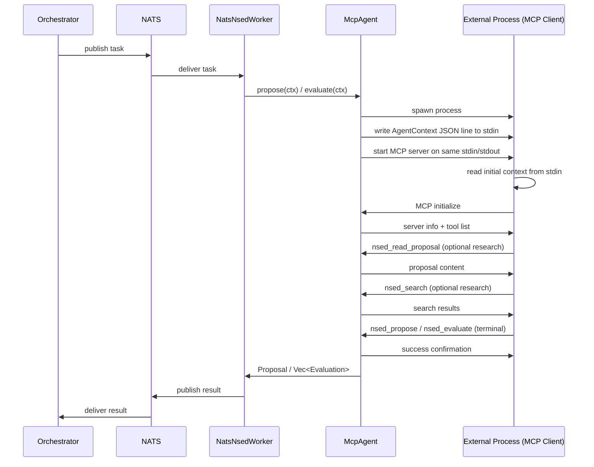
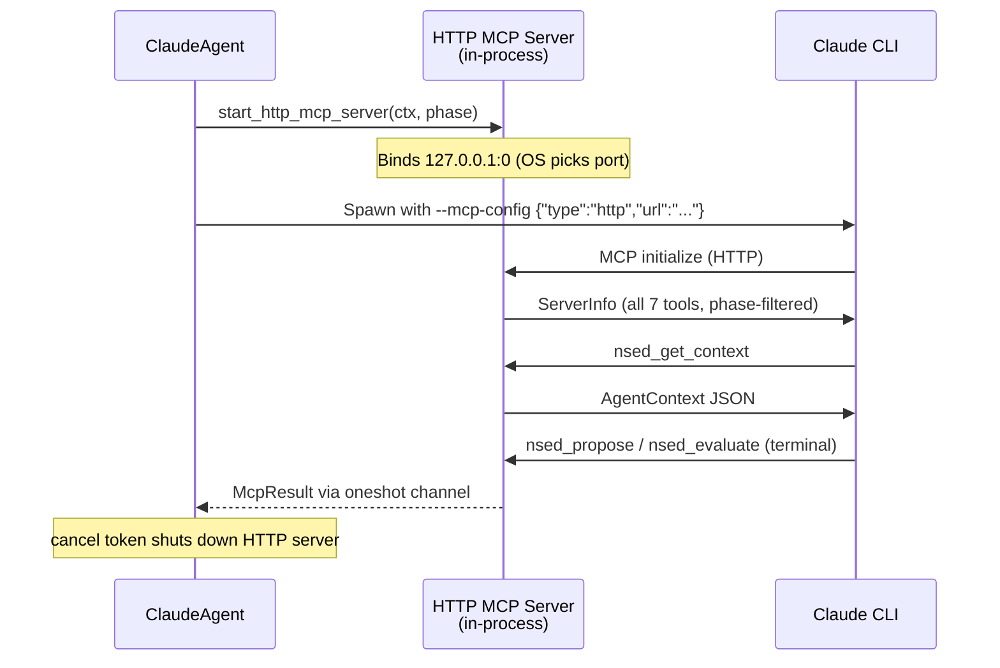

# MCP Agent Protocol

The MCP (Model Context Protocol) provider enables external agents to participate in NSED deliberation with **full tool access** — reading past proposals, searching history, updating scratchpad — before submitting their result. Unlike the [exec provider](exec-agent-protocol.md) (one-shot stdin/stdout), MCP agents get a bidirectional tool-calling channel.

## Hybrid Protocol

The MCP provider uses a **hybrid stdin-push + MCP** approach:

1. **Context push**: The `AgentContext` JSON envelope is written to stdin as a single line (same format as exec provider)
2. **MCP session**: The same stdin/stdout pipes then carry MCP JSON-RPC messages for tool calls and submission

This ensures context is immediately available without requiring a tool call, while MCP provides the tool-calling channel.



## Stdin Envelope

The first line written to the subprocess stdin is a JSON object identical to the exec provider envelope:

```json
{
  "phase": "propose",
  "context": {
    "task_description": "Design an authentication system",
    "round_number": 1,
    "total_rounds": 3,
    "phase": "Proposing",
    "candidates": [],
    "previous_own_proposal": null,
    "previous_critiques": [],
    "user_injections": [],
    "phase_budget_remaining_secs": 120.0,
    "session_id": "abc123"
  }
}
```

After this line, the same stdin/stdout carry MCP JSON-RPC messages. The subprocess should:
1. Read and parse the first line as the context envelope
2. Begin the MCP handshake on the same pipes

## MCP Tools

The NSED MCP server exposes the following tools:

### Terminal Tools (exactly one must be called)

| Tool | Phase | Description |
|------|-------|-------------|
| `nsed_propose` | propose | Submit a proposal. Ends the phase. |
| `nsed_evaluate` | evaluate | Submit evaluations. Ends the phase. |

### Research Tools (optional, call as needed)

| Tool | Description |
|------|-------------|
| `nsed_get_context` | Refresh the deliberation context (also pushed via stdin) |
| `nsed_read_proposal` | Read a proposal from a previous round by agent ID |
| `nsed_read_critiques` | Read evaluation feedback from evaluators |
| `nsed_search` | Full-text search across deliberation history |
| `nsed_update_scratchpad` | Write to persistent cross-round memory |

### Tool Schemas

#### `nsed_propose`

```json
{
  "thought_process": "string — your reasoning and analysis",
  "content": "string — the actual proposal"
}
```

#### `nsed_evaluate`

```json
{
  "evaluations": [
    {
      "target_id": "string — candidate ID being evaluated",
      "score": 0.85,
      "justification": "string — brief reasoning for the score",
      "stance": "strong_agree | agree | neutral | disagree | strong_disagree (optional)",
      "is_final_solution": false,
      "claim_assessments": [
        {
          "claim_id": "string — 6-char hex ID for cross-round tracking (optional)",
          "claim": "string — the claim being assessed",
          "verdict": "verified | contested | unverified | wrong",
          "reason": "string — reasoning for the verdict (optional)"
        }
      ],
      "disagreements": [
        {
          "claim_id": "string — references a claim_id above (optional)",
          "proposal_claims": "string — what the proposal claims",
          "evaluator_position": "string — the evaluator's counter-position",
          "confidence": "high | medium | low"
        }
      ],
      "category_scores": {
        "correctness": 85.0,
        "completeness": 70.0,
        "novelty": 60.0,
        "feasibility": 90.0,
        "evidence_quality": 75.0
      }
    }
  ]
}
```

Score range: `0.0` (worst) to `1.0` (best). All fields beyond `target_id`, `score`, and `justification` are optional — agents can submit minimal evaluations or the full structured analysis.

The structured evaluation fields align with the NSED Vector Alignment protocol used by native LLM agents:

| Field | Description |
|-------|-------------|
| `stance` | Overall evaluator position toward the proposal |
| `is_final_solution` | Whether this proposal is viable as a final answer |
| `claim_assessments` | Assessment of key claims with verdicts (verified/contested/unverified/wrong) |
| `disagreements` | Specific disagreement points with counter-positions |
| `category_scores` | Per-category quality scores on a 0–100 scale |

#### `nsed_read_proposal`

```json
{
  "agent_id": "string — author's agent ID (required)",
  "round": 1,
  "offset": 0,
  "limit": 5000
}
```

#### `nsed_read_critiques`

```json
{
  "round": 1,
  "agent_id": "string — filter by evaluator (optional)"
}
```

#### `nsed_search`

```json
{
  "query": "string — free-text search",
  "round": 1,
  "agent_id": "string — filter by agent (optional)"
}
```

#### `nsed_update_scratchpad`

```json
{
  "content": "string — replaces current scratchpad content"
}
```

## Phase-Aware Tool Filtering

During the propose phase, only `nsed_propose` is available as a terminal tool. During the evaluate phase, only `nsed_evaluate` is available. Calling the wrong terminal tool returns an error message (not a protocol error).

## YAML Configuration

```yaml
providers:
  mcp_local:
    type: mcp

agents:
  - name: PYTHON_MCP_AGENT
    provider_id: mcp_local
    model_name: custom
    mcp:
      command: ["python3", "agents/mcp_agent.py"]
      # working_dir: "/opt/agents"
      # timeout_secs: 60
      # env:
      #   OPENAI_API_KEY: "sk-..."
```

### `McpProviderConfig` Fields

| Field | Type | Default | Description |
|-------|------|---------|-------------|
| `command` | `Vec<String>` | required | Command and arguments. First element is the binary. |
| `working_dir` | `Option<String>` | cwd | Working directory for the subprocess. |
| `env` | `Map<String, String>` | `{}` | Extra environment variables (additive). |
| `timeout_secs` | `Option<u64>` | budget/300s | Hard timeout. Falls back to phase budget, then 300s. |

## Environment Variables

In addition to the `env` map from config, the MCP provider injects these environment variables into the subprocess:

| Variable | Description | Example |
|----------|-------------|---------|
| `NSED_SESSION_ID` | Deliberation session ID (for stateful agents) | `abc123` |
| `NSED_AGENT_NAME` | This agent's name | `RESEARCH_AGENT` |
| `NSED_ROUND` | Current round number | `2` |
| `NSED_PHASE` | Current phase (`propose` or `evaluate`) | `propose` |

These enable stateful agents like Claude CLI to maintain session continuity:

```yaml
mcp:
  command: ["claude", "--session-id", "${NSED_SESSION_ID}", "--mcp-config", "tools.json"]
```

## Timeout Behavior

The effective timeout follows this priority:
1. `timeout_secs` from config (if set)
2. `phase_budget_remaining_secs` from the agent context (rounded up, minimum 1s)
3. 300 seconds (default fallback)

If the subprocess doesn't call a terminal tool within the timeout, the process is killed and the phase fails.

## Claude CLI Provider

The `claude` provider is a specialized wrapper around the MCP protocol that automatically constructs Claude CLI flags from `AgentConfig` fields. It uses the same hybrid stdin+MCP protocol under the hood.

### YAML Configuration

```yaml
providers:
  claude_cli:
    type: claude

agents:
  - name: CLAUDE_REVIEWER
    provider_id: claude_cli
    model_name: sonnet
    persona: "You are a security-focused code reviewer"
    system_prompt_override: "Review all proposals for security vulnerabilities"
    claude:
      permission_mode: bypassPermissions
      max_budget_usd: 0.50
      mcp_config: ["./nsed-tools.json"]
      allowed_tools: ["Read", "Grep", "Bash(git:*)"]
      context_files: ["docs/architecture.md", "specs/api-contract.json"]
      extra_args: ["--verbose"]
```

### AgentConfig → Claude CLI Flag Mapping

| AgentConfig Field | Claude CLI Flag | Notes |
|-------------------|----------------|-------|
| `model_name` | `--model` | Skipped if "custom" |
| `system_prompt_override` | `--system-prompt` | Full system prompt replacement |
| `persona` | `--append-system-prompt` | Appended to default system prompt |
| `session_id` (from context) | `--session-id` (round 1) / `--resume` (round 2+) | Conversation persistence |
| — | `--print` | Always set (non-interactive mode) |
| — | `--output-format json` | Always set (structured output) |

### `ClaudeProviderConfig` Fields

| Field | Type | Default | Description |
|-------|------|---------|-------------|
| `model` | `Option<String>` | `AgentConfig.model_name` | Model override (e.g. "opus") |
| `working_dir` | `Option<String>` | cwd | Working directory |
| `env` | `Map<String, String>` | `{}` | Extra env vars |
| `timeout_secs` | `Option<u64>` | budget/600s | Hard timeout |
| `permission_mode` | `String` | `"bypassPermissions"` | `--permission-mode` value |
| `max_budget_usd` | `Option<f64>` | — | `--max-budget-usd` per phase |
| `mcp_config` | `Vec<String>` | `[]` | Paths to MCP config JSON files |
| `allowed_tools` | `Vec<String>` | `[]` | `--allowed-tools` filter |
| `context_files` | `Vec<String>` | `[]` | Files injected into system prompt (see below) |
| `add_dirs` | `Vec<String>` | `[]` | Directories for Claude tool access (`--add-dir`) |
| `disallowed_tools` | `Vec<String>` | `[]` | Additional `--disallowed-tools` entries |
| `writable` | `bool` | `false` | Allow Write/Edit/NotebookEdit tools. Read-only by default. |
| `agents` | `Map<String, ClaudeSubAgentDef>` | `{}` | Sub-agent definitions (`--agents`). See below. |
| `extra_args` | `Vec<String>` | `[]` | Additional CLI flags |

### Context Files

The `context_files` field allows injecting file contents into Claude's system prompt per agent. Each file is read by NSED at invocation time and inlined as a `<context_file>` block via `--append-system-prompt`. No directory access is granted — use `add_dirs` to explicitly allow Claude tool access to directories.

```yaml
claude:
  context_files:
    - docs/architecture.md       # relative to working_dir
    - /abs/path/to/spec.json     # absolute paths also work
```

This is useful for giving each agent domain-specific knowledge:

```yaml
agents:
  - name: SECURITY_REVIEWER
    provider_id: claude_cli
    model_name: opus
    claude:
      context_files: ["docs/security-policy.md", "specs/auth-flow.md"]

  - name: PERFORMANCE_REVIEWER
    provider_id: claude_cli
    model_name: sonnet
    claude:
      context_files: ["docs/perf-baselines.md", "benchmarks/latest.json"]
```

Missing files are silently skipped with a warning log. Relative paths resolve from `working_dir` (if set), otherwise from the current directory.

### Directory Access (`add_dirs`)

Grant Claude Read tool access to specific directories:

```yaml
claude:
  add_dirs:
    - ./src              # relative to working_dir
    - /data/shared       # absolute path
```

**Security defaults:**

- **Read-only by default**: `writable: false` auto-injects `--disallowed-tools Write,Edit,NotebookEdit`. Set `writable: true` to allow file modifications.
- **Sandbox isolation**: When no `add_dirs` are configured, NSED injects `--add-dir /tmp/nsed_claude_sandbox` (an empty directory) to prevent Claude from accessing the working directory. Without this, Claude's `bypassPermissions` mode grants full CWD access.
- **`disallowed_tools`**: Merges with the read-only defaults. Specify additional tools to block (e.g., `["Bash"]`).

### Sub-Agents (`agents`)

Define Claude sub-agents that the primary agent can delegate to. Each sub-agent runs in its own context window with a custom system prompt, specific tool access, and independent permissions. See [Claude Code sub-agents docs](https://code.claude.com/docs/en/sub-agents).

```yaml
claude:
  agents:
    researcher:
      description: "Searches technical documentation"
      prompt: "You research topics thoroughly and return structured findings"
      tools: ["Read", "Grep", "Glob", "Bash"]
      model: haiku
      maxTurns: 10
      effort: medium
    fact_checker:
      description: "Verifies claims against source material"
      prompt: "You verify factual claims and flag inaccuracies"
      tools: ["Read", "Grep"]
      disallowedTools: ["Write", "Edit"]
      permissionMode: dontAsk
    db_analyst:
      description: "Executes read-only database queries"
      prompt: "You are a data analyst. Execute SELECT queries only."
      tools: ["Bash"]
      background: true
      isolation: worktree
      memory: project
      skills: ["sql-patterns"]
      mcpServers:
        - github
        - playwright:
            type: stdio
            command: npx
            args: ["-y", "@playwright/mcp@latest"]
```

#### `ClaudeSubAgentDef` fields

| Field | Type | Required | Description |
|-------|------|----------|-------------|
| `description` | `String` | Yes | When Claude should delegate to this sub-agent |
| `prompt` | `String` | Yes | System prompt (the sub-agent's instructions) |
| `tools` | `Vec<String>` | No | Tool allowlist. Inherits all if omitted |
| `disallowedTools` | `Vec<String>` | No | Tool denylist, removed from inherited/allowed |
| `model` | `String` | No | `"sonnet"`, `"opus"`, `"haiku"`, `"inherit"`, or full model ID |
| `permissionMode` | `String` | No | `"default"`, `"acceptEdits"`, `"dontAsk"`, `"bypassPermissions"`, `"plan"` |
| `maxTurns` | `u32` | No | Maximum agentic turns before the sub-agent stops |
| `mcpServers` | `Vec<Value>` | No | MCP servers: string references or inline `{ "name": { config } }` |
| `effort` | `String` | No | `"low"`, `"medium"`, `"high"`, `"max"` (Opus only) |
| `background` | `bool` | No | Run concurrent with main conversation |
| `isolation` | `String` | No | `"worktree"` for isolated git worktree |
| `memory` | `String` | No | Persistent memory: `"user"`, `"project"`, or `"local"` |
| `skills` | `Vec<String>` | No | Skills to preload into context |
| `initialPrompt` | `String` | No | Auto-submitted first turn when running as main agent |

This maps to `--agents '<JSON>'`, enabling Claude to spawn specialized sub-agents during deliberation.

## Comparison: Exec vs MCP vs Claude

| Feature | Exec | MCP | Claude |
|---------|------|-----|--------|
| Context delivery | stdin JSON (one-shot) | stdin JSON push + `nsed_get_context` | stdin push + `nsed_get_context` |
| Response delivery | stdout JSON | `nsed_propose` / `nsed_evaluate` | `nsed_propose` / `nsed_evaluate` |
| Tool access | None | Full (read proposals, search, scratchpad) | Full + Claude's built-in tools |
| Session persistence | None | Via env vars | `--session-id` / `--resume` |
| Configuration | Manual command | Manual command | Auto-built from AgentConfig |
| Complexity | Simple | Requires MCP client library | Zero-code (YAML only) |
| Best for | Simple scripts, CLI tools | Custom LLM agents | Claude as a deliberation agent |

## Example: Python MCP Client

See [`crates/nsed-cli/examples/mcp_agent.py`](../crates/nsed-cli/examples/mcp_agent.py) for a complete reference implementation using the Python `mcp` package.

Minimal structure:

```python
#!/usr/bin/env python3
import asyncio, json, sys
import anyio
from mcp.client.session import ClientSession
from mcp.shared.message import SessionMessage
from mcp.types import JSONRPCMessage

async def main():
    loop = asyncio.get_event_loop()

    # Step 1: Read initial context from stdin
    first_line = await loop.run_in_executor(None, sys.stdin.readline)
    envelope = json.loads(first_line)
    context = envelope["context"]
    phase = envelope["phase"]

    # Step 2: Set up MCP client on same stdin/stdout
    # (see full example for stream bridging code)

    # Step 3: Use MCP tools
    async with ClientSession(...) as session:
        await session.initialize()

        if phase == "propose":
            # Optional: research
            # await session.call_tool("nsed_search", {"query": "..."})

            await session.call_tool("nsed_propose", {
                "thought_process": "My reasoning...",
                "content": "My proposal...",
            })

if __name__ == "__main__":
    asyncio.run(main())
```

## In-Process HTTP MCP Server

The `claude` provider runs `NsedMcpServer` as an **in-process HTTP server** on localhost. Claude CLI connects to it via `"type": "http"` in `--mcp-config`, giving it access to all 7 deliberation tools. Results flow back through an in-process channel — no temp files, no subprocess.



### How It Works

1. `ClaudeAgent::start_http_mcp_server()` binds a TCP listener on `127.0.0.1:0` (OS-assigned port)
2. `NsedMcpServer` is served via rmcp's `StreamableHttpService` with `LocalSessionManager` (stateful mode)
3. A `SharedMcpState` (behind `Arc`) shares the `AgentContext` and a `oneshot::Sender<McpResult>` across server instances
4. `write_mcp_config_http(port)` generates a temp config file for Claude CLI
5. When the agent calls a terminal tool (`nsed_propose` / `nsed_evaluate`), the result is sent through the oneshot channel
6. `ClaudeAgent` cancels the `CancellationToken` to shut down the HTTP server after receiving the result

### MCP Config Format

The generated `--mcp-config` uses HTTP transport:

```json
{
  "mcpServers": {
    "nsed": {
      "type": "http",
      "url": "http://127.0.0.1:{port}/mcp"
    }
  }
}
```

No `command`, `args`, or `env` fields — Claude CLI connects to an already-running server.

## Error Handling

| Scenario | Behavior |
|----------|----------|
| Subprocess exits without calling terminal tool | Error: "terminal tool channel closed without result" |
| Subprocess times out | Process killed, error: "timed out after Ns" |
| Wrong terminal tool for phase | Error message returned via MCP (not protocol error) |
| Subprocess fails to start | Error: "failed to spawn" |
| Empty command | Error: "command is empty" |
