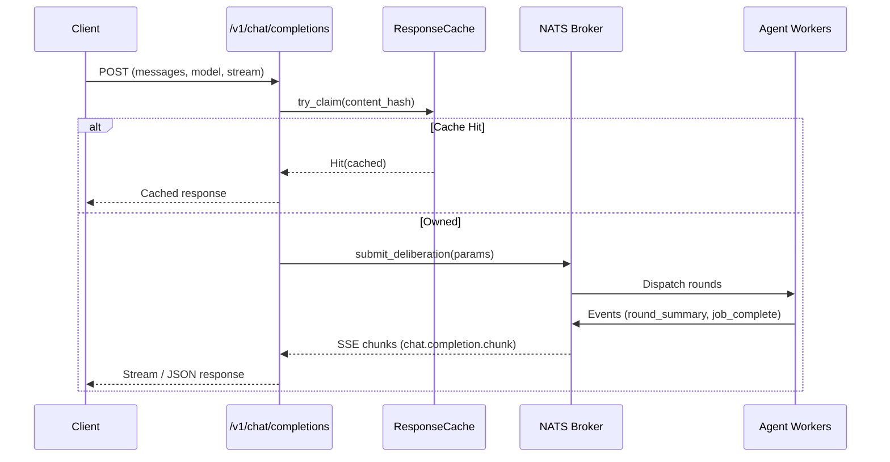

# Chat Completions API

NSED exposes a standard OpenAI-compatible `/v1/chat/completions` endpoint that
makes it plug-and-play with Cursor, Chatbox, and any Vercel AI SDK wrapper.


## Endpoint

```http
POST /v1/chat/completions
Authorization: Bearer <token>
Content-Type: application/json
```

## Request Format

Standard OpenAI Chat Completions schema:

```json
{
  "model": "nsed:*",
  "messages": [
    {"role": "system", "content": "You are a helpful assistant."},
    {"role": "user", "content": "What is 2 + 2?"}
  ],
  "stream": true,
  "max_tokens": 1000,
  "tools": [
    {
      "type": "function",
      "function": {
        "name": "calculator",
        "description": "Evaluate math expressions",
        "parameters": {"type": "object", "properties": {}}
      }
    }
  ]
}
```

### Model Resolution

The `model` field maps to NSED policies:

All model strings are resolved by `resolve_policy()` via tag lookup
against the policy registry. The execution mode depends on the resolved
policy's `mode` field, not the model name itself. The examples below
reflect the default simulation config — production deployments may
define different policies for the same tags.

| Model string | Resolution | Default simulation behaviour |
|---|---|---|
| `nsed:fast` | Tag lookup → first policy tagged `"fast"` | 1-round deliberation |
| `nsed:deep` | Tag lookup → first policy tagged `"deep"` | 5-round deliberation |
| `nsed:moderated` | Tag lookup → first policy tagged `"moderated"` | Single-agent moderator |
| `nsed:passthrough` | Tag lookup → first policy tagged `"passthrough"` | Single-agent passthrough |
| `nsed:*` | Wildcard → first registered policy | depends on registry |
| `nsed:<tag>` | Tag lookup → first matching policy | depends on registry |
| `nsed:<policy_id>` | Exact content-hash match | depends on policy |

### Execution Modes

The resolved policy's `mode` field controls which execution path the
handler takes:

| Mode | Path | Use for |
|---|---|---|
| `Deliberation` (default) | Full propose → evaluate → converge cycle via JetStream | Code review, architecture decisions, multi-agent deliberation |
| `Passthrough` | Direct NATS request-reply to a single agent | Autocomplete, linting, raw utility tasks |
| `Moderator` | Direct NATS request-reply to the `moderator: true` role agent | Title generation, summaries, lightweight admin tasks |

Both `Passthrough` and `Moderator` bypass JetStream orchestration
entirely: no room state, no KV buckets, no deliberation rounds. The
response is synchronous — the agent receives the request, calls its
LLM, and replies. When `stream: true`, the handler wraps the
synchronous response as a minimal SSE sequence (role chunk → content
chunk → finish chunk → `[DONE]`).

### NSED Metadata

Responses from `Passthrough` and `Moderator` modes include an optional
`nsed_metadata` field:

```json
{
  "id": "chatcmpl-abc123",
  "object": "chat.completion",
  "choices": [{ "message": { "content": "..." } }],
  "nsed_metadata": {
    "mode": "moderator"
  }
}
```

Clients that don't understand `nsed_metadata` ignore it (OpenAI clients
tolerate extra fields). Clients that DO understand it (e.g. OpenCode)
can use it to skip their own title-agent invocation when
`mode == "moderator"`.

### Known Limitations

| Limitation | Impact | Workaround |
|---|---|---|
| Moderator and passthrough reuse the same NATS `passthrough` subject | No explicit opt-in from agents for moderation tasks | Pin moderator role to a specific agent in the policy config |
| Agent worker event loop serializes all message types | A moderator request blocks behind in-flight deliberation tasks on the same agent | Pin the moderator role to a dedicated agent not shared with deliberation policies |
| NATS subject prefix hardcoded as `"nsed"` for passthrough subjects | Must stay in sync with agent SDK default manually | Documented with TODO in `submit_single_agent` |
| `nsed_metadata` only on `ChatCompletionResponse`, not on SSE chunks | Streaming clients cannot inspect the mode mid-stream | Mode is evident from the model tag (`nsed:moderated`) |

## Response Format

### Non-Streaming (`stream: false`)

```json
{
  "id": "chatcmpl-abc123",
  "object": "chat.completion",
  "created": 1234567890,
  "model": "nsed:fast",
  "choices": [
    {
      "index": 0,
      "message": {
        "role": "assistant",
        "content": "The answer is 4."
      },
      "finish_reason": "stop"
    }
  ]
}
```

### Streaming (`stream: true`)

SSE stream of `chat.completion.chunk` events:

```text
data: {"id":"chatcmpl-abc","object":"chat.completion.chunk","choices":[{"index":0,"delta":{"role":"assistant"},"finish_reason":null}]}

data: {"id":"chatcmpl-abc","object":"chat.completion.chunk","choices":[{"index":0,"delta":{"reasoning_content":"Round 1 complete — convergence: 45%"},"finish_reason":null}]}

data: {"id":"chatcmpl-abc","object":"chat.completion.chunk","choices":[{"index":0,"delta":{"content":"The answer is 4."},"finish_reason":null}]}

data: {"id":"chatcmpl-abc","object":"chat.completion.chunk","choices":[{"index":0,"delta":{},"finish_reason":"stop"}]}

data: [DONE]
```

### Reasoning Content

NSED deliberation rounds are emitted as `reasoning_content` deltas (DeepSeek-R1/O3
convention). Clients that support reasoning display it as thinking blocks; others
silently ignore the field.

### Tool Calls

When tools are defined and the deliberation engine triggers a tool call, the
response includes `tool_calls` in the delta with `finish_reason: "tool_calls"`:

```json
{
  "choices": [{
    "delta": {
      "tool_calls": [{
        "index": 0,
        "id": "call_abc",
        "type": "function",
        "function": {"name": "calculator", "arguments": "{\"expr\":\"2+2\"}"}
      }]
    },
    "finish_reason": "tool_calls"
  }]
}
```

## Keep-Alive

NSED jobs can be long-running. During idle periods (workers evaluating but not
emitting text), the server sends SSE keep-alive comments every 15 seconds:

```text
: keep-alive
```

This prevents client-side TCP/HTTP timeout disconnects and the infinite retry
loops they cause.

## Deduplication

The chat completions endpoint uses the same content-hash-based dedup cache as
the Responses API. Deduplication is handled by the orchestrator, not this SDK.

## Session Continuation & Mid-Flight Injection

Clients that want to pin a multi-turn chat to a stable thread on the server
can send an `x-opencode-session` header (the same one OpenCode uses). NSED
uses that header to derive a stable **thread base** and routes requests
according to this rule:

| State of prior job under this session | `stream: true` | `stream: false` |
|---|---|---|
| No prior job | Submit new job with `room_id = {thread_base}-{timestamp_ms}`; return SSE chunks | Submit new job; block until completion and return a `chat.completion` JSON response |
| Prior job `Running` | **Inject** the latest user message; reconnect the caller to the existing SSE event stream | **Inject** the latest user message; block until the prior job reaches a terminal state and return a `chat.completion` JSON response |
| Prior job `Completed` / `Failed` | Submit new job with `room_id = {thread_base}-{timestamp_ms}`; return SSE chunks | Submit new job; block until completion and return a `chat.completion` JSON response |

In every fresh-job case the full conversation history is already present
in the request's `messages[]` array (clients echo it on every turn), so
context is preserved even when we cannot inject into a live deliberation.

Each turn gets a unique `{thread_base}-{timestamp_ms}` `room_id` so that a
second turn arriving after the first has completed cannot collide with the
terminal KV entry of the prior job. Mid-deliberation follow-ups (message 2
sent while message 1 is still streaming) land as user injections on the
currently-active round rather than spinning up a parallel job.

> **Note:** Mid-flight injection requires the client to actually send a
> second request while the first is still streaming. Standard OpenAI chat
> clients (including OpenCode) block user input until the current SSE
> stream completes, so the injection path mostly fires when a separate
> tool or script posts a follow-up via a parallel HTTP call.

### Example — mid-flight injection

```bash
# Terminal 1: start a slow deliberation
curl -N -X POST http://localhost:8080/v1/chat/completions \
  -H "Authorization: Bearer $NSED_TOKEN" \
  -H "x-opencode-session: ses_example" \
  -d '{
    "model": "nsed:deep",
    "messages": [{"role": "user", "content": "Design a distributed cache"}],
    "stream": true
  }'

# Terminal 2 (a few seconds later, while ^ is still streaming):
curl -X POST http://localhost:8080/v1/chat/completions \
  -H "Authorization: Bearer $NSED_TOKEN" \
  -H "x-opencode-session: ses_example" \
  -d '{
    "model": "nsed:deep",
    "messages": [
      {"role": "user", "content": "Design a distributed cache"},
      {"role": "user", "content": "Focus on memory safety over throughput"}
    ],
    "stream": false
  }'
```

The server scans for an active job under `oc-ses_example`, finds the
deliberation from terminal 1, and injects `"Focus on memory safety over
throughput"`. Because terminal 2 set `stream: false`, the server then
blocks on the injected job until it reaches a terminal state and returns
the final `chat.completion` JSON response — whereas terminal 1, still
holding its `stream: true` SSE connection, continues to receive chunks
and sees a `user_injection` event at the next phase boundary as the
deliberation adapts to the new guidance. Had terminal 2 also used
`stream: true`, it would have been reconnected to the shared SSE event
stream instead.

## NSED-specific SSE delta fields

The chat-completions translator adds side-channel fields to each
`chat.completion.chunk` that OpenAI-spec clients ignore but NSED-aware
UIs (the `/chat` SPA, dashboards) consume. These ride on the `choices[0].delta`
object alongside `content` / `reasoning_content`.

| Field | When | Shape | Purpose |
|---|---|---|---|
| `nsed_session_id` | First chunk of the stream | `string` | Session id for inject/finalize/resume endpoints. Also sent as `x-nsed-session-id` response header. |
| `nsed_round` | Each `proposal_submitted` and each `round_summary` | `{round, total_rounds, progress, scored, candidates: [...]}` | Structured carousel payload — see below |
| `nsed_injected` | `user_injection` event from the orchestrator | `{message, round, sequence}` | UI uses this to split the current assistant bubble and render the nudge as a fresh user bubble |
| `nsed_finalized` | `user_finalized` event (local user pick) | `{chosen_agent_id, round}` | UI badges the chosen candidate and collapses the carousel |

### `nsed_round` candidate shape

Each entry of `candidates[]`:

```json
{
  "agent_id": "CortexA",
  "score": 0.47,
  "content_preview": "...full proposal text...",
  "thought_preview": "...untruncated reasoning...",
  "claims": [
    {"claim": "O(n log n) sort", "verdict": "verified", "reason": "..."},
    {"claim": "handles empty input", "verdict": "contested", "reason": "..."}
  ]
}
```

- `content_preview` carries the **full** proposal text (no server-side char
  cap). UIs should apply a CSS `line-clamp` for card views and
  show the full body in detail modals.
- `thought_preview` is the **full** `thought_process` — untruncated for the
  same reason.
- `claims[]` collapses duplicate claim assessments across evaluators by
  worst-verdict-wins (`wrong` > `contested` > `unverified` > `verified`)
  so the UI never masks a dissent behind a later approval. Capped at 8.
- `scored: false` on `proposal_submitted`-derived payloads (no evals yet);
  `scored: true` when driven by a `round_summary` with aggregated scores.

## `/resume` endpoint

`POST /deliberation/{session_id}/resume` reattaches a client to a live
deliberation that the SSE connection lost (network blip, page reload,
mobile sleep). The server replays the full event history from the job's
persisted KV bucket via `DeliverPolicy::All`, then tails live events,
so the client sees identical content to an uninterrupted stream.

Request body: empty. Returns an SSE stream shaped identically to
`/v1/chat/completions` responses.

The chat UI auto-invokes `/resume` on transient disconnects using the
`nsed_session_id` captured from the first chunk of the original stream.

## Architecture



## Client Configuration Examples

### Cursor

```json
{
  "openai.apiBase": "http://localhost:8080/v1",
  "openai.apiKey": "your-token"
}
```

### Chatbox

Provider: OpenAI-compatible
Base URL: `http://localhost:8080/v1`
Model: `nsed:*`

### Vercel AI SDK

```typescript
import { createOpenAI } from '@ai-sdk/openai';

const nsed = createOpenAI({
  baseURL: 'http://localhost:8080/v1',
  apiKey: 'your-token',
});
```
