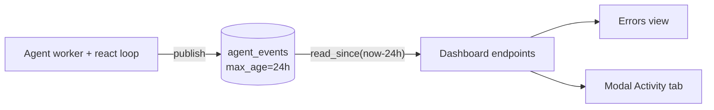

# Dashboard config

> Reference for the knobs that control whether the unified agent
> dashboard starts, where it binds, and how it authenticates.

## Knobs

| input | type | source | precedence |
|---|---|---|---|
| `--dashboard-port <PORT>` | `u16` | `quorum serve` CLI flag | wins over yaml |
| `dashboard_port` | `Option<u16>` | top-level field in `quorum.yml` | falls back to None |
| `--dashboard-bind <ADDR>` | `IpAddr` string | `quorum serve` CLI flag | wins over env var |
| `QUORUM_DASHBOARD_BIND` | `IpAddr` string | env var | falls back to `127.0.0.1` |
| `QUORUM_DASHBOARD_TOKEN` | `String` | env var | falls back to no auth |

## Resolution

```text
port  = --dashboard-port > quorum.yml::dashboard_port > None
bind  = --dashboard-bind > $QUORUM_DASHBOARD_BIND > "127.0.0.1"
token = $QUORUM_DASHBOARD_TOKEN > (unset → auth disabled)
```

When `port` resolves to `None`, **no dashboard starts** regardless
of bind. When `port` is set but the `status-server` feature is
compiled out, `quorum serve` logs a warn and continues without
the dashboard.

## Bind values

Any string `std::net::IpAddr::from_str` accepts:

| value | meaning |
|---|---|
| `127.0.0.1` (default) | loopback IPv4 — local only |
| `::1` | loopback IPv6 — local only |
| `0.0.0.0` | all IPv4 interfaces — LAN-visible |
| `::` | all interfaces, dual-stack — LAN-visible |
| `192.168.1.42` | bind to a specific NIC IP only |

Malformed input (typo, hostname instead of IP, garbage) is
**silently downgraded to loopback** — the boot-time `info!` log
line shows the resolved bind so the operator can spot the
fallback.

## Feature gate

The dashboard implementation lives behind `[features]
status-server` in `crates/quorum-rs/Cargo.toml`. The default
feature set on this crate is:

```text
default = ["audit", "cli", "tui", "status-server"]
```

…so a stock `cargo install` build includes the dashboard. Builds
that opt out (`--no-default-features --features cli,tui`) compile
the flag-resolution code but never start the server; a warn line
notes the no-op:

```text
WARN dashboard_port set but `status-server` feature not compiled in
     — no dashboard will start.
```

## Bearer-token auth

Set `QUORUM_DASHBOARD_TOKEN` to guard the `/api/*` control plane
with a bearer token. When set, every `/api/*` request must carry
`Authorization: Bearer <token>` or it is rejected with `401`. The
dashboard HTML page, the Swagger UI, `/api-docs/openapi.json`, and
`GET /auth/status` stay public so the page can load and the
frontend can prompt for the token before connecting. The dashboard
UI exposes a token field; the value is stored in `localStorage`
(`quorum_dashboard_token`) and attached to every guarded request.

Token comparison is constant-time. When `QUORUM_DASHBOARD_TOKEN`
is unset (or empty) auth is disabled and `/api/*` is open — the
historical loopback-default behaviour, intended for local dev.

`GET /auth/status` reports the guard state:

```json
{ "auth_required": true, "authenticated": false }
```

A non-loopback bind **without** a token is **fail-closed** — the server
**refuses to start the dashboard** rather than expose the control plane
unauthenticated:

```text
ERROR refusing to start the dashboard: bound to a non-loopback address with
      no QUORUM_DASHBOARD_TOKEN — that would expose the control plane
      unauthenticated. Set QUORUM_DASHBOARD_TOKEN, or bind to loopback.
```

Loopback binds stay open (local dev); anything wider requires a token. See
[how-to/expose-agent-dashboard-on-lan.md] for the full recipe
(token, bind, plus firewall / reverse-proxy hardening).

## Agent event log (NATS-backed 24h history)

The dashboard's 24h operator views — the fleet **Errors** view and the per-agent
modal's **Activity** tab — are backed by a JetStream stream, not an in-memory
buffer. Each agent persists its own lifecycle events to the subject
`agent.events.<agent_name>` under a shared stream `agent_events` with **24h
retention** (`max_age`) and a hard cap of **10,000** events
(`STREAM_MAX_MESSAGES`). The window therefore survives restarts.

Event kinds: `agent_error`, `task_started` / `task_completed` / `task_failed`,
and `tool_call_started` / `tool_call_finished`.

This log lives entirely in the agent's own NATS scope. The orchestrator never
publishes to it or consumes from it. The dashboard runs in the agent process
and holds each agent's JetStream context, so it reads the stream directly (an
ephemeral pull consumer filtered to the agent subject, drained per request).



### `GET /api/agents/errors`

Fleet-wide `agent_error` feed, newest-first across all agents. The UI groups it
per agent with a free-text filter (agent, model, job, detail).

```json
{
  "window_hours": 24,
  "stream_cap": 10000,
  "total": 1,
  "errors": [
    {
      "agent": "ALPHA",
      "model_name": "MiniMax-M2.5",
      "timestamp": "2026-08-16T10:15:03.512+00:00",
      "job_id": "job-1",
      "detail": "evaluate failed: API request failed with status 404"
    }
  ]
}
```

### `GET /api/agents/{name}/tasks`

Reconstructs the agent's tasks/queries by pairing `task_started` with its
finish event, split into `in_flight` (no finish yet) and `finished`.

### `GET /api/agents/{name}/tool-calls`

Reconstructs tool invocations by pairing `tool_call_started` with
`tool_call_finished` on a shared `call_id`, split into `pending` and
`finished` (each carries tool name, args summary, and result/status).

**Retention honesty.** The window is a real 24h, time-based (JetStream
`max_age`), and restart-surviving. The only remaining bound is the 10k-event
hard cap per stream: an agent emitting more than 10,000 events inside 24h evicts
its oldest events early. `stream_cap` is returned so the UI can state it. When
the process has no NATS the views degrade to empty rather than erroring.

## See also

- [how-to/expose-agent-dashboard-on-lan.md] — operator recipe
- `crates/quorum-rs/src/status/agent_events.rs` — event log store, read, and
  view reconciliation
- `crates/quorum-rs/src/status/multi_server/mod.rs::run_control_plane`
  — bind resolution + boot
- `crates/quorum-rs/src/status/multi_server/mod.rs::agents_errors`
  — fleet API-error feed handler
- `crates/quorum-rs/src/config.rs::AgentFleetConfig` — `dashboard_port` field
- `crates/quorum-rs/src/main.rs::Serve` — CLI flags
