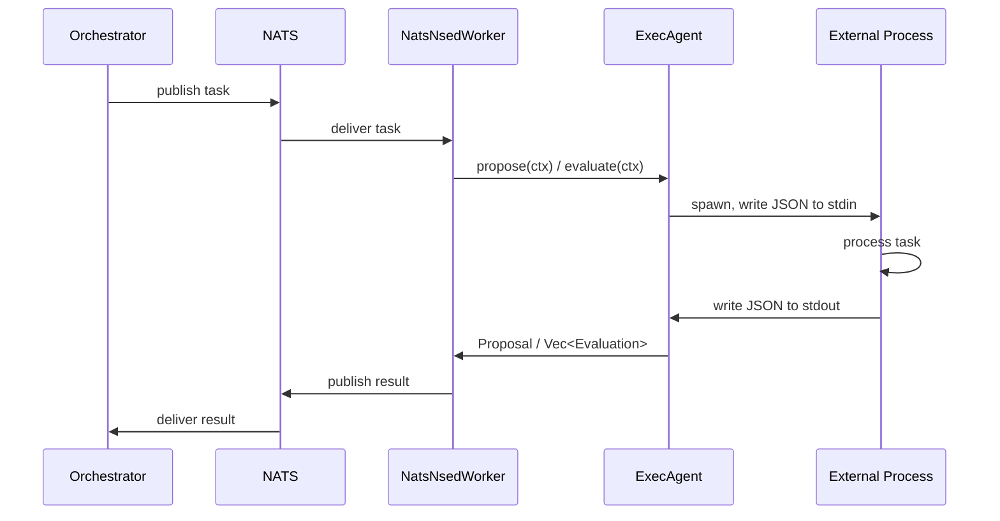

# Exec agent protocol

The exec provider enables external processes (Python, TypeScript, shell scripts, etc.) to participate as NSED deliberation agents without speaking NATS or implementing Rust traits. The Rust `ExecAgent` acts as a bridge: it receives tasks from NATS, spawns the subprocess, feeds it JSON via stdin, reads the response from stdout, and publishes results back to NATS.

> **Need tool access?** If your agent needs to read past proposals, search history, or maintain persistent memory, use the [MCP agent protocol](mcp-agent-protocol.md) instead — it extends this protocol with bidirectional tool calling via the Model Context Protocol.



## Stdin Envelope

The subprocess receives a single JSON object on stdin, then stdin is closed (EOF). The process must read all of stdin before producing output.

```json
{
  "phase": "propose",
  "context": {
    "task_description": "Design an authentication system",
    "round_number": 1,
    "phase": "Propose",
    "candidates": [],
    "previous_own_proposal": null,
    "previous_critiques": [],
    "user_injections": [],
    "phase_budget_remaining_secs": 120.0
  }
}
```

| Field | Type | Description |
|-------|------|-------------|
| `phase` | `"propose"` \| `"evaluate"` | Which deliberation phase to execute |
| `context` | `AgentContext` | Full deliberation context (see below) |

### AgentContext Fields

| Field | Type | Description |
|-------|------|-------------|
| `task_description` | `string` | The deliberation task/question |
| `round_number` | `integer` | Current round (1-indexed) |
| `phase` | `string` | Phase name (`"Propose"`, `"Evaluate"`) |
| `candidates` | `array` | Proposals to evaluate (evaluate phase only) |
| `previous_own_proposal` | `object?` | This agent's proposal from the previous round |
| `previous_critiques` | `array` | Feedback received on previous proposals |
| `user_injections` | `array` | Mid-deliberation user messages |
| `phase_budget_remaining_secs` | `float` | Remaining time budget for this phase |

## Stdout Response

### Propose Phase

```json
{
  "thought_process": "Step-by-step reasoning about the task...",
  "content": "The actual proposal text..."
}
```

| Field | Type | Required | Description |
|-------|------|----------|-------------|
| `thought_process` | `string` | Yes | Internal reasoning (visible to evaluators) |
| `content` | `string` | Yes | The proposal content |

### Evaluate Phase

```json
{
  "evaluations": [
    {
      "target_id": "AGENT_A",
      "score": 0.85,
      "justification": "Well-structured approach with clear reasoning"
    },
    {
      "target_id": "AGENT_B",
      "score": 0.6,
      "justification": "Covers basics but lacks depth"
    }
  ]
}
```

| Field | Type | Required | Description |
|-------|------|----------|-------------|
| `evaluations` | `array` | Yes | One entry per candidate |
| `evaluations[].target_id` | `string` | Yes | Must match a candidate's `id` from context |
| `evaluations[].score` | `float` | Yes | Score between 0.0 and 1.0 |
| `evaluations[].justification` | `string` | Yes | Explanation for the score |

## Stdout Delimiter Protocol

External frameworks (LangChain, CrewAI, etc.) often leak warnings, deprecation notices, or debug logs to stdout. To handle this reliably, the exec agent uses a 3-tier extraction strategy:

### Strategy 1: Delimiters (Recommended)

Wrap the response JSON between `___NSED_START___` and `___NSED_END___` markers:

```text
Loading model weights...
WARNING: deprecated API
___NSED_START___
{"thought_process": "reasoning", "content": "my proposal"}
___NSED_END___
Cleanup done
```

This is immune to any library chatter on stdout. **All new exec agents SHOULD use this approach.**

### Strategy 2: Last JSON Object (Fallback)

If no delimiters are found, the extractor scans from the end of stdout for the last complete `{...}` block with balanced braces:

```text
LangChainDeprecationWarning: some warning
{"thought_process": "reasoning", "content": "my proposal"}
```

This handles simple pollution but may break with nested JSON in log output.

### Strategy 3: Raw Parse

If stdout contains clean JSON with no pollution, it is parsed directly.

### Best Practice

Scripts **SHOULD** use delimiters and **MUST** send all non-payload output to stderr:

```python
import sys
print("Debug info", file=sys.stderr)  # stderr: diagnostics
print("___NSED_START___")              # stdout: delimiter
print(json.dumps(result))              # stdout: payload
print("___NSED_END___")               # stdout: delimiter
```

## Stderr Handling

All stderr output is captured and logged as warnings via `tracing::warn`. Stderr is for diagnostics only and is never parsed as a response. Write freely to stderr for debugging.

## Timeout Behavior

The subprocess timeout is determined in this order:

1. `exec.timeout_secs` in agent config (explicit override)
2. `context.phase_budget_remaining_secs` (adaptive, from orchestrator)
3. 300 seconds (default fallback)

On timeout:
- The process is killed via `SIGKILL`
- The process is reaped (no zombies)
- An error is returned to the worker

## Process Lifecycle

Per propose/evaluate call:

1. **Spawn**: `tokio::process::Command` with `kill_on_drop(true)`
2. **Write**: JSON envelope to stdin, then close stdin (EOF)
3. **Drain**: stdout and stderr are read concurrently via separate `tokio::spawn` tasks to prevent OS pipe buffer deadlock (~64KB limit)
4. **Wait**: Process exit with timeout
5. **Extract**: JSON from stdout using the 3-tier strategy
6. **Parse**: Deserialize into `Proposal` or evaluation response

If the Rust future is dropped (e.g., worker shutdown), `kill_on_drop(true)` ensures the child process is killed.

## Error Handling

| Condition | Behavior |
|-----------|----------|
| Empty command | Error before spawn |
| Command not found | Spawn error with command path |
| Non-zero exit code | Error with exit code + first 500 chars of stderr |
| Empty stdout | Error: "process produced no output" |
| Invalid JSON | Error with first 200 chars of stdout for debugging |
| Timeout | Process killed, error with timeout duration |
| Pipe buffer full | Handled: concurrent drain prevents deadlock |

## YAML Configuration

### Provider

```yaml
providers:
  exec_local:
    type: exec
```

The `exec` provider type skips API key validation and does not create an LLM client.

### Agent

```yaml
agents:
  - name: PYTHON_AGENT
    provider_id: exec_local
    model_name: custom
    exec:
      command: ["python3", "examples/exec_agent.py"]
      # working_dir: "/opt/agents"           # optional
      # timeout_secs: 30                      # optional (default: phase budget)
      # env:                                  # optional (additive)
      #   MY_API_KEY: "sk-..."
```

### `ExecProviderConfig` Fields

| Field | Type | Default | Description |
|-------|------|---------|-------------|
| `command` | `string[]` | required | Command + args (e.g., `["python3", "agent.py"]`) |
| `working_dir` | `string?` | `null` | Working directory for the subprocess |
| `env` | `map<string, string>` | `{}` | Additional environment variables (additive to parent) |
| `timeout_secs` | `integer?` | `null` | Hard timeout override per call |

## Reference Implementation

See [`examples/exec_agent.py`](../../examples/exec_agent.py) for a complete Python reference that demonstrates:

- Reading the JSON envelope from stdin
- Dispatching by `phase` field
- Writing delimited response to stdout
- Logging diagnostics to stderr

## Quick Start

```bash
# 1. Test the reference agent manually
echo '{"phase":"propose","context":{"task_description":"test","round_number":1,"phase":"Propose","candidates":[],"previous_round_matrix":null,"previous_critiques":[],"user_injections":[],"phase_budget_remaining_secs":60.0}}' \
  | python3 examples/exec_agent.py

# 2. Configure in quorum.yml
# providers:
#   exec_local:
#     type: exec
# agents:
#   - name: MY_AGENT
#     provider_id: exec_local
#     model_name: custom
#     exec:
#       command: ["python3", "my_agent.py"]

# 3. Run via your orchestrator
# Start the orchestrator with this agent config
```

## Provider Envelope Unwrapping

Some exec providers return their output wrapped in a provider-specific JSON envelope rather than the bare NSED protocol format. The exec agent automatically detects and unwraps these envelopes.

Currently supported: the `{"type":"result","result":...}` shape (e.g., Claude CLI `--output-format json`). The `result` field is extracted and:

- **String result** → coerced to `{"thought_process":"(generated by exec provider)","content":"<text>"}` for propose, or neutral 0.5 scores for evaluate
- **Object result** → parsed directly as `Proposal` or evaluation response

> **Note**: For Claude CLI, use the dedicated `type: claude` provider instead of `type: exec`.
> It auto-constructs CLI flags from typed config (model, permissions, budget, context files,
> sub-agents, sandbox isolation, read-only defaults). See [MCP agent protocol — Claude CLI provider](mcp-agent-protocol.md#claude-cli-provider).

### Adding New Provider Formats

To support additional provider envelopes, add detection logic to `unwrap_provider_envelope()` in `exec_agent.rs`. The function returns `Some(inner)` if a known wrapper is detected, `None` otherwise.

## Limitations (Phase 1)

- **No process group kill**: Only the direct child is killed on timeout. If the subprocess spawns grandchildren, they may orphan. Phase 2 will add process-group `SIGKILL`.
- **No persistent state**: Each call spawns a fresh process. For stateful agents, use a file or database between calls.
- **No streaming**: The entire response is read after the process exits. Phase 2 (MCP protocol) will support interactive, streaming agents.
