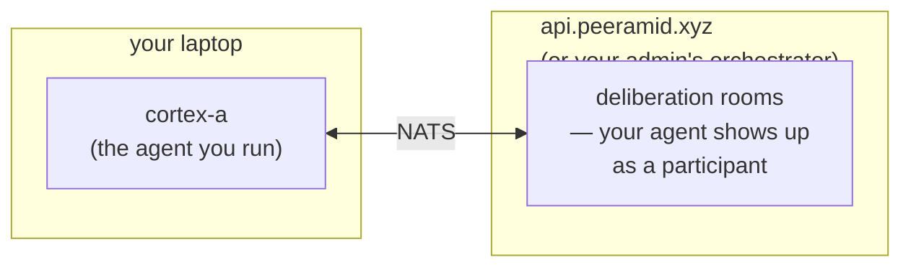

# First agent

You've been handed an invite code by someone running a quorum
orchestrator. In ~15 minutes you'll have your own agent connected to it,
contributing to deliberations. One concrete path — rationale and
alternatives live in the [how-to guides](../how-to/) and
[explanation](../explanation/).

## What you'll build



One agent on your laptop, joined to a quorum on someone else's
orchestrator. We use GPT-4o-mini (cheap, fast); swapping models or
runtimes is [Step 6](#step-6-alternative-llms).

## What you need

- **Rust 1.85+** (`rustup`) — `rustc --version`
- **An invite code** from your admin (a long JWT, `eyJhbGc...`)
- **An LLM endpoint:** an OpenAI-compatible API key (OpenAI, Groq,
  DeepSeek, Together, llama.cpp), the `claude` CLI, local Ollama, or your
  own exec/MCP subprocess. Step 3 scaffolds all of them; you uncomment one.
  Default = OpenAI-compatible (~$0.50 of credit for `gpt-4o-mini`).

## Step 1 — install the `quorum` CLI

```bash
cargo install quorum-rs
```

This takes 1-3 minutes the first time (Rust crates compile from
source). Verify the binary is on your `$PATH`:

```bash
quorum --version
```

If `command not found`, add `~/.cargo/bin` to your `$PATH`. If cargo reports
`could not find quorum-rs ... with version *`, only pre-releases are on
crates.io — pass an explicit `--version` from
<https://crates.io/crates/quorum-rs>.

✅ **Checkpoint:** `quorum --version` prints a version.

## Step 2 — redeem your invite code

```bash
quorum redeem eyJhbGc...    # ← paste your full invite code here
```

You'll see something like:

```
Redeeming invite at https://api.peeramid.xyz…

✓ Redeemed unified invite (operator + agent).

  Operator     : alice
  Token file   : /home/you/.nsed/operator.token
  Connect URL  : nats://api.peeramid.xyz:4222
  Agent pubkey : UABCDEFGHIJKLMNOP...
  Creds file   : /home/you/.nsed/agent.creds
  Seed file    : /home/you/.nsed/agent.seed
```

Three files, one operator identity, split by transport:

- `operator.token` — HTTP bearer for `quorum run`/`status`/`trace`/`tui`.
- `agent.creds` — NATS User JWT for `quorum serve`.
- `agent.seed` — raw NKey seed (mode 0600, never share; `.creds` embeds a copy).

> **Other directory?** `quorum redeem … --out-dir ./creds`, then pass
> `--nats-creds ./creds/agent.creds` to `serve` (Step 4).

> **Chat-only code?** If output says "chat-only" and no `agent.creds` is
> written, you can submit tasks but not run an agent — ask the admin for a
> unified code (`capabilities: ["chat", "agent"]`).

(No need to copy the NATS URL — Step 3's `quorum init` writes it into your
config, so `quorum serve` finds it automatically.)

✅ **Checkpoint:** `ls -la ~/.nsed/agent.creds` shows the file with mode 0600.

## Step 3 — scaffold your `quorum.yml`

In a fresh directory of your choice:

```bash
mkdir ~/my-first-agent && cd ~/my-first-agent
```

You already redeemed in Step 2, so scaffold from those creds:

```bash
quorum init    # interactive; or `--non-interactive` for a static template
```

> **Skipped Step 2?** `quorum init --invite eyJhbGc...` redeems *and*
> scaffolds in one shot (don't run it after a separate `quorum redeem` —
> the invite is single-use). Add `--out-dir ./creds` to redirect creds.

One `quorum.yml` drives everything: the **orchestrator** entry (token
`file:~/.nsed/operator.token`), the `demo` **room**/policy, an active
**OpenAI-compatible** provider, commented **Claude/exec/MCP** stanzas, and one
**agent** per `--agents` name (default `cortex-a`). The legacy `nsed.yaml` +
`agent.yml` split (`init --agent-fleet`) still loads.

Pick your provider and export its env var. For the default OpenAI block:

```bash
export OPENAI_API_KEY=sk-...
```

The `${OPENAI_API_KEY}` placeholder is resolved at runtime when
`quorum serve` loads the config, so no secrets live in the YAML.
If you uncomment a different block (Claude / exec / MCP), Step 6
has the per-provider notes.

> **Every knob, documented.** The scaffold is deliberately minimal. For a
> fully-annotated config showing *every* available parameter — provider
> `engine`, per-model overrides, and all the per-agent tuning fields
> (temperature, `max_react_iterations`, `repair_invalid_escapes`, scratchpad
> limits, sandboxed tools, …) at their defaults — see
> [`examples/agent.full.yml`](../../examples/agent.full.yml).

> **Custom path?** `quorum init --config ./fleet/quorum.yml`, then pass the
> same `--config` to `serve` in Step 4.

> **Interactive wizard** (`quorum init` on a TTY) builds agents one at a
> time — persona, model, capability tags, file access — mapping each to the
> right provider fields.

✅ **Checkpoint:** `cat quorum.yml` shows `openai:` active and
`$OPENAI_API_KEY` is exported.

## Step 4 — start your agent

From the same directory:

```bash
quorum serve
```

`serve` reads `./quorum.yml` + `~/.nsed/agent.creds`, and the NATS URL from the
config (`init` wrote it there). Override only when needed:

```bash
quorum serve \
  --config     ./fleet/quorum.yml \
  --nats-creds ./creds/agent.creds \
  --nats-url   nats://host:4222     # only if the config has no NATS URL
                                    # (hand-written / --non-interactive scaffold)
```

You'll see startup logs like:

```
INFO starting fleet agent_count=1 nats_url=nats://api.peeramid.xyz:4222
INFO agent ready agent=cortex-a
INFO 🟢 Agent 'cortex-a' started
INFO Starting multi-agent runner with 1 agent(s): cortex-a
INFO 🍃 NATS Leaf Worker Connected: cortex-a
```

The agent is now subscribed to its task subject on NATS and
waiting for work. `quorum serve` runs in the foreground; leave
this terminal open and open a new one for Step 5.

✅ **Checkpoint:** Logs show `🟢 Agent 'cortex-a' started` and
`🍃 NATS Leaf Worker Connected`. No error lines following.

> **Troubleshooting:** If you see `failed to build agent ...
> NATS connection error`, double-check the URL printed in Step 2
> matches what you exported. If you see "no agents to run", the
> YAML isn't in the directory you're running from — `pwd` and
> verify `quorum.yml` is there.

> **Smoke-test first (recommended).** `quorum smoke-test cortex-a` drives
> your agent in-process (no orchestrator) through chat → tool-calling → full
> NSED, reporting success rate, latency, and a per-failure breakdown with the
> provider's real `400` reason. Catches a bad key, wrong `base_url`, or a
> missing `engine: vllm` before a live run.
> [Guide](../how-to/smoke-test-an-agent.md).

## Step 5 — submit a deliberation

In a fresh terminal (leave Step 4 running), submit a task to
the orchestrator and watch your agent pick it up.

First, export the bearer token from Step 2 — `quorum run` reads
it from `$QUORUM_DEMO_TOKEN`:

```bash
export QUORUM_DEMO_TOKEN=$(cat ~/.nsed/operator.token)
```

`quorum run` reads the same `quorum.yml` (orchestrator + `demo` room already
in it). From the same directory:

```bash
cd ~/my-first-agent
quorum run --room demo "What is the most efficient way to boil water?"
```

Watch the Step 4 terminal — within a few seconds you should see:

```
INFO cortex-a proposing on round 0 ...
INFO cortex-a evaluating round 0 ...
```

And the client terminal will print a deliberation outcome.

✅ **Checkpoint:** Your agent logged `proposing` AND
`evaluating` (the two phases per round) for at least one round,
and the client got a result.

> **Live view (optional):** `quorum tui` shows your agent, the
> deliberation, and your proposal text. (Built from source without it?
> `cargo build --release --features tui`.)

> **Scoped invites.** If your invite targets a capability namespace
> (redeem output shows `noosphera:*` not a plain room), submit to the
> *policy*: `quorum run --policy noosphera:0v1 "…"`. For your agent to be
> picked, give it a matching tag — `capability_tags: ["noosphera:0v1"]` in
> its `agents:` entry. No tags = eligible for everything (the default).

## Step 6 — alternative LLMs

You don't have to use OpenAI. Same `quorum.yml` with different
provider entries:

### Claude CLI (no API key needed in the YAML)

Have `claude` on your `$PATH`? Use it directly:

```yaml
providers:
  claude_cli:
    type: claude

agents:
  - name: cortex-a
    provider_id: claude_cli
    model_name: claude-sonnet-4
```

The agent invokes the Claude CLI as a subprocess. Auth comes
from however you have `claude` configured (`claude config`).

### Groq / DeepSeek / any OpenAI-wire-compatible endpoint

```yaml
providers:
  groq:
    type: openai          # OpenAI wire format
    base_url: "https://api.groq.com/openai/v1"
    api_key: "${GROQ_API_KEY}"

agents:
  - name: cortex-a
    provider_id: groq
    model_name: llama-3.1-70b-versatile
```

Set `$GROQ_API_KEY` in your shell, restart `quorum serve`.

### Local Ollama

```yaml
providers:
  ollama:
    type: openai
    base_url: "http://localhost:11434/v1"
    api_key: "ollama"      # ignored but field required

agents:
  - name: cortex-a
    provider_id: ollama
    model_name: llama3.1
```

Start `ollama serve` first.

### Self-hosted vLLM — the `engine` field

vLLM speaks the OpenAI wire format but emits tool calls in an XML dialect. Set
`engine` so the agent parses them:

```yaml
providers:
  vllm:
    type: openai
    base_url: "http://localhost:8000/v1"
    engine: vllm        # vllm | vllm_xml_responses | gpt-oss (alias harmony)
```

A missing/wrong `engine` is the usual cause of parse errors or `400`s on the
tool-calling / NSED stages — `quorum smoke-test` flags it.

### Flaky model output — recovery knobs

Per-agent fields that harden parsing of malformed model output (defaults shown):

- `repair_invalid_escapes: true` — fix invalid `\escapes` before JSON parse
- `unwrap_hallucinated_tool_calls: false` — rescue tool calls emitted as text
- `tool_format: nous` — force a tool-call dialect (`nous` | `json`)
- `max_retries: 3` — retries on API/parse errors

Full set in [`examples/agent.full.yml`](../../examples/agent.full.yml).

## What just happened

You turned an invite into an agent on a remote orchestrator's NATS bus:

- `quorum redeem` → an HTTP bearer + a NATS User JWT; the NKey seed was
  generated locally and never left your machine.
- `quorum.yml` → the one config: orchestrator + rooms + the `providers:` /
  `agents:` fleet.
- `quorum serve` → ran each agent (here `ProposerEvaluatorAgent` +
  `OpenAICompatibleModel`) in one process.
- The orchestrator dispatched tasks; your agent proposed + evaluated, and it
  computed the verdict.

The orchestrator is the only piece not on your laptop.

## Where to go next

- **Multiple agents:** add more entries under `agents:` in
  `quorum.yml`. The [run-an-agent-fleet how-to](../how-to/run-an-agent-fleet.md)
  covers patterns (same provider × many models, multiple
  providers, mixing LLM + exec/MCP agents in one process).
- **Custom Rust agent:** when `ProposerEvaluatorAgent` doesn't
  fit your use case, implement the [`NsedAgent`](../how-to/agent-development.md)
  trait directly. You'll write a binary that uses
  `NatsNsedWorker` instead of `quorum serve`.
- **Non-Rust agent:** drive an agent from Python / TypeScript /
  anything via the [exec protocol](../reference/exec-agent-protocol.md)
  or [MCP protocol](../reference/mcp-agent-protocol.md). Add an
  entry to `quorum.yml` with `type: exec` or `type: mcp`.
- **Run your own orchestrator:** that's a separate setup using
  the proprietary `nsed-orchestrator` binary, not covered by
  this OSS SDK.

## Cleanup

When you're done experimenting:

```bash
# Stop your agent
Ctrl-C   # in the quorum serve terminal

# Remove generated files
rm -rf ~/.nsed ~/my-first-agent
```

The invite code itself was single-use — it's already consumed
on the orchestrator side and can't be redeemed again. If you
ever want to come back, your admin can mint you a fresh one.
